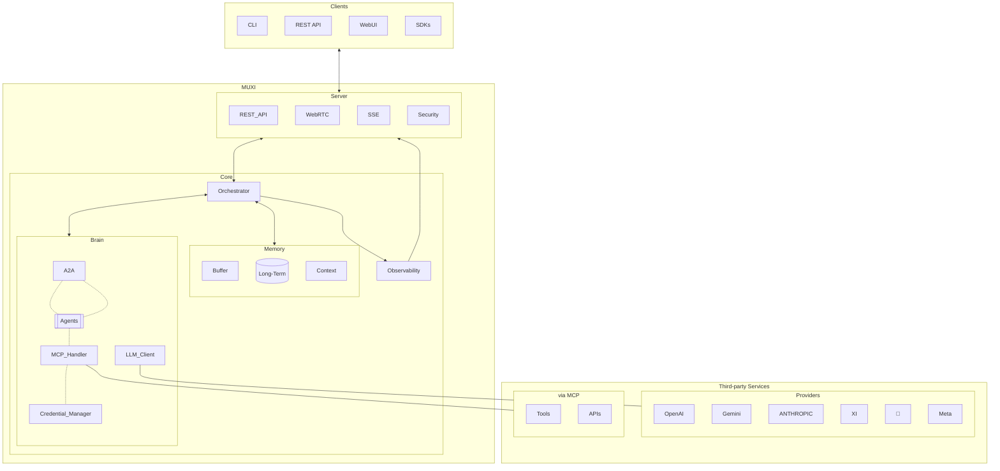

# MUXI Framework Restructuring PRD

## Overview

This document outlines the plan to restructure the MUXI Framework into a more intuitive and maintainable architecture. The restructuring aims to simplify the mental model, create more intuitive package names, establish a cleaner dependency graph, and improve the overall developer experience.

## Current Structure

The MUXI Framework currently consists of several components with unclear boundaries:

- `core`: Contains the core functionality and components
- `server`: Provides server capabilities
- `webui`: Web-based user interface
- `cli`: Command line interface
- Various client implementations

This structure has led to some confusion and potential circular dependencies.

## Proposed Structure

### Conceptual Components
- **MUXI server**: Combines what is currently in core and server packages
- **MUXI clients**: Various client implementations (CLI, SDKs, WebUI)

### Package Organization

- **`muxi`**: Main package combining what is now core + server, CLI, and Python SDK
  - Optional installation: `muxi[studio]` to include web studio
- **muxi-cli**: Command-line interface package
- **muxi-studio**: Web-based UI (currently webui)
- **Language-specific SDKs**:
  - `muxi-sdk-python` (on PyPI)
  - `muxi-sdk-node` (on npm)
  - etc.
- **muxi-llm**: New package providing a unified interface for LLM communication

### Repository Organization

To better support independent development cycles and contributor focus, we will organize the codebase into separate repositories:

1. **muxi-llm**: Standalone repository with Apache 2.0 license
   - Enables broader adoption and contributions for the LLM abstraction layer
   - Can evolve independently with its own release cycle
   - Allows for use in non-MUXI projects

2. **muxi-cli**: Separate repository focused on command-line tools
   - Focuses contributors interested in CLI experiences
   - Allows for independent versioning and releases

3. **muxi-studio**: Dedicated repository for the web interface
   - Separates front-end development concerns
   - Enables independent UI/UX evolution

4. **muxi**: Main repository that depends on the above components
   - May include these components as submodules or dependencies
   - Provides integration examples and comprehensive documentation

This organization supports:
- Focused contribution workflows
- Independent release cycles
- Clearer component boundaries
- Better separation of concerns
- Flexible licensing options

## Benefits of Restructuring

1. **Simplified Mental Model**: Clear separation between server and client components
2. **Intuitive Package Names**: `muxi` as the main package is more user-friendly
3. **Cleaner Dependency Graph**: Clients depend on server interfaces without circular dependencies
4. **Better Installation Experience**: Familiar optional installation pattern (e.g., `muxi[studio]`)
5. **Language-Specific SDK Separation**: Each SDK in its own package following modern conventions
6. **Focused LLM Interface**: Dedicated package for LLM interactions with clear responsibility boundary



## Key Architectural Changes

### Server and Orchestrator Integration

A significant architectural improvement in this restructuring is the elimination of redundant server components:

1. **Single Server Architecture**:
   - In the current architecture, `orchestrator.run()` and `muxi.run()` start their own server, and a separate API server connects to it
   - In the new architecture, there will be a single server that directly uses the orchestrator as a component
   - The server layer will handle authentication, API keys, and user context

2. **Component-Based Integration**:
   - The server directly instantiates and uses the orchestrator object
   - No more client-server relationship between server and orchestrator
   - Cleaner separation of concerns:
     - Orchestrator focuses on agent coordination, memory, etc.
     - Server handles HTTP/WebSocket concerns and authentication

3. **Developer Usage**:

	**Programmatic way**

	```python
   from muxi import Orchestrator, Agent, Server

   # Create orchestrator with agents
   orchestrator = Orchestrator()
   orchestrator.add_agent(Agent(...))

   # Create and start server
   server = Server(orchestrator)
   server.run(host="0.0.0.0", port=8000)
   ```

   **Declarative way**

   ```python
   from muxi import muxi, Server
   from dotenv import load_dotenv

   # Load environment variables
   load_dotenv()

   # Initialize MUXI
   app = muxi()

   # Add an agent from a configuration file
   app.add_agent("assistant", "configs/assistant.yaml")

   # Create and start server
   server = Server(app)
   server.run(host="0.0.0.0", port=8000)
   ```

## Detailed Implementation Plan

### Phase 1: Create muxi-llm Package

1. Create new repository/package "muxi-llm"
   - Initialize with Apache 2.0 license to encourage broader adoption and contributions
   - Set up project structure with clear documentation
   - Establish API contracts that will be stable for consumers
2. Implement unified LLM interface inspired by litellm
3. Start with OpenAI integration
4. Set up CI/CD, documentation, and testing for the new package
5. Publish as an initial release to PyPI

### Phase 2: Restructure Core Packages

1. Create new "muxi" package structure
   - Start with a fresh repository
   - Set up project structure with proper packaging
   - Implement core functionality (from current core package)
   - Integrate server functionality (from current server package)
   - Replace direct LLM implementations with muxi-llm dependency
   - Move authentication and API key management to server layer
   - Remove redundant server in orchestrator
   - Set up tests, CI/CD, and documentation
2. Migrate test suites to match new package boundaries

### Phase 3: Develop Client Packages

1. **muxi-cli**
   - Create separate repository for CLI functionality
   - Set up project structure and CI/CD workflows
   - Make it depend on muxi package
   - Ensure all commands work with the new structure
   - Set up tests and documentation
   - Publish as a standalone package

2. **muxi-studio**
   - Create separate repository for the web interface
   - Refactor the current webui into muxi-studio
   - Update API calls to work with the new muxi server structure
   - Implement any new features specific to the web interface
   - Set up tests, CI/CD, and documentation
   - Publish as a standalone package

3. **Language-specific SDKs**
   - Create initial language SDK packages (starting with Python and Node.js)
   - Implement client libraries that communicate with the muxi server
   - Provide language-specific convenience wrappers
   - Set up tests, CI/CD, and documentation for each SDK

### Phase 4: Integration and Verification

1. Ensure all packages work together correctly
   - Create integration tests that verify cross-component functionality
   - Test installation flows with various combinations of components
2. Set up the main repository to properly reference/include the separated components
   - Either as dependencies or submodules depending on development workflow needs
3. Verify that the entire system functions as expected end-to-end
4. Update all documentation to reflect new architecture and repository organization
5. Create migration guides for any early adopters
6. Set up example projects demonstrating the new component-based approach

---

## `muxi-llm` Package Details

### Purpose

The muxi-llm package will provide a unified interface for communicating with various LLM providers. It will abstract away the differences between providers, allowing for easy switching between them and simplifying the rest of the MUXI codebase.

### Licensing

The muxi-llm package will be released under the Apache 2.0 license to:
- Enable broader adoption outside the MUXI ecosystem
- Encourage open-source contributions
- Allow usage in both commercial and non-commercial projects
- Provide clear patent grants

This more permissive license reflects the utility nature of the package and its potential value to the broader development community.

### Implementation Approach

1. **Initial Setup**
   - Create basic package structure
   - Define core interfaces and types
   - Implement configuration system

2. **OpenAI Integration**
   - Implement OpenAI provider as the first supported LLM
   - Cover all necessary API endpoints
   - Ensure comprehensive error handling

3. **Future Expansions**
   - Add additional providers (Anthropic, Gemini, etc.)
   - Implement provider-specific optimizations
   - Add caching and rate limiting features

### Interface Design

```python
# Simplified example of the anticipated interface
from muxi_llm import LLMClient, OpenAIProvider

# Create a client with a specific provider
llm = LLMClient(provider=OpenAIProvider(api_key="..."))

# Simple completion
response = await llm.complete("Hello, world!")

# Chat completion
response = await llm.chat([
    {"role": "system", "content": "You are a helpful assistant."},
    {"role": "user", "content": "Tell me about MUXI."}
])

# Embedding
embedding = await llm.embed("Some text to embed")
```

---

## Timeline and Milestones

### Milestone 1: Foundations
- Create separate repositories for muxi-llm, muxi-cli, and muxi-studio
- Set up Apache 2.0 license for muxi-llm
- Develop and release an initial version of muxi-llm
- Design the new integrated server-orchestrator architecture
- Begin restructuring core functionality into the new muxi package

### Milestone 2: Core Development
- Complete muxi package restructuring
- Implement the integrated server that directly uses orchestrator as a component
- Move authentication and API key management to server layer
- Develop and test muxi-cli package

### Milestone 3: Client Development
- Develop and test muxi-studio package
- Develop initial language-specific SDKs
- Update all clients to work with the new server architecture

### Milestone 4: Integration and Release
- Integration testing and bug fixes
- Documentation and final preparations for release
- Create example projects demonstrating the new component-based approach
- Ensure smooth cross-repository workflow

## Conclusion

This restructuring will provide a more intuitive, maintainable, and extensible architecture for the MUXI Framework. By clearly separating concerns and providing a more modular approach, we will improve both the developer experience and the potential for future expansion.

The separation into distinct repositories with appropriate licensing will encourage broader community engagement and allow each component to evolve at its appropriate pace. The Apache 2.0 license for muxi-llm specifically will position it as a valuable tool for the broader AI development community.

The lack of backward compatibility concerns (as MUXI is not yet released) provides a perfect opportunity to implement these foundational changes that would be more difficult to make after release.
