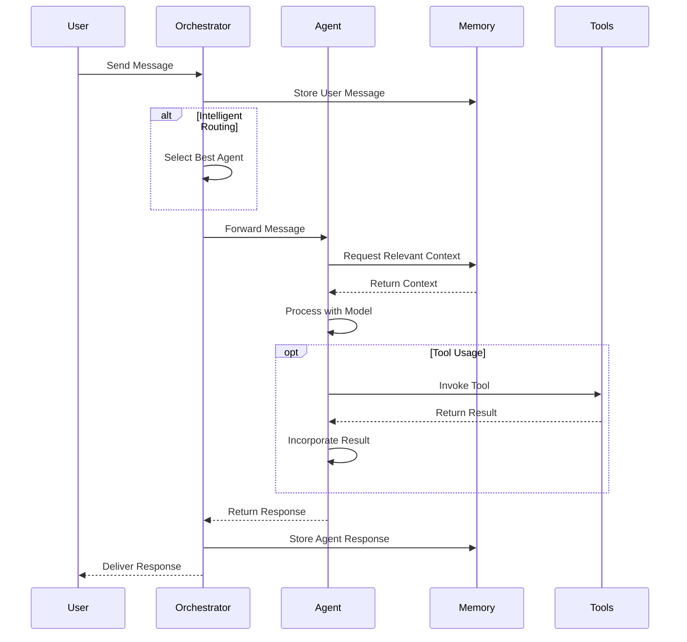

# Conversations in Muxi Core

Conversations are the primary way users interact with Muxi Core agents. This document explains how conversations work, how they're managed, and how to implement effective conversation flows.

## Conversation Architecture

In Muxi Core, conversations follow a structured flow from user input to agent response:



## Message Handling

### Message Format

Messages in Muxi Core are represented by the `MCPMessage` class:

```python
from muxi.core.mcp import MCPMessage

# Create a user message
user_message = MCPMessage(
    role="user",
    content="What's the weather like today?"
)

# Create an assistant message
assistant_message = MCPMessage(
    role="assistant",
    content="The weather today is sunny with a high of 75°F."
)
```

### Processing Messages

Processing a message through the orchestrator:

```python
# Send a message and get response
response = await orchestrator.chat(
    message="What's the capital of France?",
    agent_name="assistant"  # Optional, uses routing if omitted
)

# Access response content
print(response.content)
```

Processing a message directly through an agent:

```python
# Process message through an agent
response = await agent.process_message(
    "What's the capital of France?"
)

# Or with an MCPMessage object
message_obj = MCPMessage(role="user", content="What's the capital of France?")
response = await agent.process_message(message_obj)
```

### Conversation Context

Conversations maintain context automatically:

```python
# A sequence of related messages
response1 = await orchestrator.run_agent(
    input_text="My name is John.",
    agent_id="assistant"
)

response2 = await orchestrator.run_agent(
    input_text="What's my name?",  # Agent should remember from context
    agent_id="assistant"
)
```

## Memory Integration

Conversations are automatically stored in memory systems.

### Buffer Memory

Recent conversation turns are stored in buffer memory:

```python
# Example of how conversations are stored in buffer memory
await orchestrator.add_to_buffer_memory(
    message="I prefer dark mode.",
    metadata={
        "role": "user",
        "timestamp": 1629814200.0,
        "agent_id": "assistant"
    }
)

await orchestrator.add_to_buffer_memory(
    message="I'll remember that you prefer dark mode.",
    metadata={
        "role": "assistant",
        "timestamp": 1629814205.0,
        "agent_id": "assistant"
    }
)
```

### Long-Term Memory

Important information can be stored in long-term memory:

```python
# Storing important conversation information long-term
await orchestrator.add_to_long_term_memory(
    content="User John Doe prefers dark mode in all applications.",
    metadata={
        "user_id": 42,
        "category": "preferences",
        "importance": 0.8
    }
)
```

### Conversation Retrieval

Retrieving relevant conversation history:

```python
# Get relevant conversation history
memories = await orchestrator.search_memory(
    query="What themes does the user prefer?",
    agent_id="assistant",
    k=5,
    use_long_term=True
)

# Format memories for use in prompt
context = ""
for memory in memories:
    context += f"{memory['metadata']['role']}: {memory['content']}\n"
```

## Multi-User Conversations

Muxi Core supports multi-user conversations through its memory systems:

```python
# Conversation with user context
response = await orchestrator.chat(
    message="What's on my schedule today?",
    agent_name="assistant",
    user_id="user_42"  # Identifies the specific user
)
```

### User-Specific Context

Tracking user-specific information:

```python
# Add user context memory
await orchestrator.add_user_context_memory(
    user_id=42,
    knowledge={
        "name": "John Doe",
        "preferences": {
            "theme": "dark",
            "language": "English"
        },
        "location": "New York"
    },
    importance=0.9
)

# Retrieve user context memory
user_context = await orchestrator.get_user_context_memory(user_id=42)
```

### Automatic Information Extraction

The system can automatically extract and store user information:

```python
# Enable automatic information extraction
orchestrator = Orchestrator(
    auto_extract_user_info=True,
    extraction_model=model
)

# Information is extracted during conversations
await orchestrator.handle_user_information_extraction(
    user_message="I live in San Francisco and my birthday is May 15.",
    agent_response="Thank you for sharing that information. I'll remember it.",
    user_id=42,
    agent_id="assistant"
)
```

## Tool Integration in Conversations

Agents can use tools during conversations:

```python
# Agent using tools in conversation
response = await agent.process_message(
    "What's the weather in New York today?"
)
# Agent automatically invokes weather tool if configured
```

### Tool Call Format

Tools are called and integrated using the MCP format:

```
TOOL CALL:
{
  "name": "get_weather",
  "parameters": {
    "location": "New York",
    "units": "fahrenheit"
  }
}

TOOL RESULT:
{
  "temperature": 72,
  "conditions": "sunny",
  "humidity": 45,
  "wind_speed": 10
}
```

## Message Routing

Routing messages to the correct agent:

```python
# Intelligent routing
agent_id = await orchestrator.select_agent_for_message(
    "What's the best way to implement quicksort in Python?"
)

response = await orchestrator.run_agent(
    input_text="What's the best way to implement quicksort in Python?",
    agent_id=agent_id
)
```

### Routing Cache

Frequently seen message patterns are cached:

```python
# Routing cache is managed automatically
orchestrator._routing_cache = {
    "weather new york": "weather_agent",
    "stock price": "finance_agent",
    "code python": "code_agent"
}
```

## Conversation Management

### Clearing Conversations

Reset conversation state when needed:

```python
# Clear buffer memory for a specific agent
orchestrator.clear_memory(agent_id="assistant")

# Clear all memories for all agents
orchestrator.clear_all_memories()

# Clear long-term memory too
orchestrator.clear_all_memories(clear_long_term=True)
```

### Conversation Metadata

Adding metadata to conversations:

```python
# Add metadata to track conversation attributes
await orchestrator.add_to_buffer_memory(
    message="Help me with my project.",
    metadata={
        "role": "user",
        "timestamp": time.time(),
        "conversation_id": "conv_123",
        "topic": "project assistance",
        "sentiment": "neutral",
        "priority": "high"
    }
)
```

## Advanced Conversation Patterns

### Structured Conversations

Implementing structured conversation flows:

```python
# Example of a structured conversation flow
async def appointment_booking_flow():
    # Step 1: Ask for appointment type
    response1 = await orchestrator.run_agent(
        input_text="I need to book an appointment.",
        agent_id="booking_agent"
    )

    # Step 2: Ask for date and time
    response2 = await orchestrator.run_agent(
        input_text="I want a dentist appointment.",
        agent_id="booking_agent"
    )

    # Step 3: Confirm appointment
    response3 = await orchestrator.run_agent(
        input_text="Next Monday at 2pm works for me.",
        agent_id="booking_agent"
    )

    # Step 4: Provide confirmation
    return response3
```

### Multi-Turn Reasoning

Breaking complex problems into steps:

```python
# Multi-turn reasoning for complex problems
async def solve_complex_problem():
    # Step 1: Understand the problem
    response1 = await orchestrator.run_agent(
        input_text="I need to calculate the optimal route for delivering packages to 10 locations.",
        agent_id="problem_solver"
    )

    # Step 2: Gather additional information
    response2 = await orchestrator.run_agent(
        input_text="The distances between locations are as follows: [data...]",
        agent_id="problem_solver"
    )

    # Step 3: Generate solution
    response3 = await orchestrator.run_agent(
        input_text="Please solve this TSP problem and give me the optimal route.",
        agent_id="problem_solver"
    )

    return response3
```

## Conversation Persistence

Conversations can be persisted and restored:

```python
# Note: This is a simplified example. Actual implementation would depend on
# your specific database setup.

# Store conversation state
async def save_conversation(conversation_id, user_id):
    # Get relevant memories
    memories = await orchestrator.search_memory(
        query="",  # Empty query to get recent messages
        agent_id="assistant",
        k=50,  # Get enough context
        filter_metadata={"conversation_id": conversation_id}
    )

    # Store in database
    db.save_conversation(conversation_id, user_id, memories)

# Restore conversation state
async def restore_conversation(conversation_id, user_id):
    # Load from database
    memories = db.load_conversation(conversation_id, user_id)

    # Restore to buffer memory
    for memory in memories:
        await orchestrator.add_to_buffer_memory(
            message=memory["content"],
            metadata=memory["metadata"]
        )
```

## Conversation Analysis

Analyzing conversations for insights:

```python
# Extract topics from conversations
async def extract_conversation_topics(conversation_id):
    memories = await orchestrator.search_memory(
        query="",
        filter_metadata={"conversation_id": conversation_id},
        k=50
    )

    # Combine messages into a document
    document = ""
    for memory in memories:
        document += memory["content"] + " "

    # Use model to extract topics
    topics = await extraction_model.extract_topics(document)
    return topics
```

## Coming Soon Features

- **Conversation Summarization**: Automatic summarization of long conversations
- **Enhanced Multi-Modal Support**: Better handling of images, audio, and other media in conversations
- **Conversation Analytics**: Advanced metrics and insights from conversations
- **Conversation Templates**: Predefined conversation flows for common scenarios
- **Conversation Branching**: Support for conversation trees with multiple paths
