# MCP Integration in Muxi Core

Muxi Core provides robust integration with the Model Control Protocol (MCP), enabling agents to access external tools and services. This document details how MCP is implemented and used within Muxi Core.

## MCP Overview

MCP (Model Control Protocol) is a standard for tool-using AI agents. It defines:

1. How tools are specified (JSON schema-based definitions)
2. How tools are called (standardized request format)
3. How tool results are returned (standardized response format)
4. How tools are discovered and registered


## MCP Architecture in Muxi Core


## Key Components

### MCPHandler

The `MCPHandler` is the main interface that agents use to access tools:

```python
from muxi.core.mcp.handler import MCPHandler
from muxi.core.mcp.service import MCPService

# Create an MCP service
mcp_service = MCPService()

# Create an MCP handler
mcp_handler = MCPHandler(
    service=mcp_service,
    tools=["search_web", "get_weather"]  # Tools to make available
)
```

### MCPService

The `MCPService` manages tool registrations and executions:

```python
from muxi.core.mcp.service import MCPService

# Create MCP service
mcp_service = MCPService()

# Register built-in tools
mcp_service.register_builtin_tools()

# Register an external MCP server
await mcp_service.register_server(
    server_id="github",
    url="https://mcp-server.example.com/github"
)
```

### MCPMessage

MCP uses a standard message format for communication:

```python
from muxi.core.mcp import MCPMessage

# Create a user message
user_msg = MCPMessage(
    role="user",
    content="What's the weather in New York?"
)

# Create a tool call message
tool_call_msg = MCPMessage(
    role="assistant",
    content="I'll check the weather for you.",
    tool_calls=[{
        "name": "get_weather",
        "parameters": {
            "location": "New York",
            "units": "fahrenheit"
        }
    }]
)

# Create a tool result message
tool_result_msg = MCPMessage(
    role="tool",
    content=None,
    tool_call_id="call_123",
    tool_name="get_weather",
    tool_result={"temperature": 72, "conditions": "sunny"}
)
```

## Tool Definitions

Tools are defined using JSON Schema:

```python
# Example tool definition
weather_tool = {
    "name": "get_weather",
    "description": "Get the current weather for a location",
    "parameters": {
        "type": "object",
        "properties": {
            "location": {
                "type": "string",
                "description": "The city and state, e.g., 'New York, NY'"
            },
            "units": {
                "type": "string",
                "enum": ["celsius", "fahrenheit"],
                "description": "Temperature units",
                "default": "fahrenheit"
            }
        },
        "required": ["location"]
    },
    "returns": {
        "type": "object",
        "properties": {
            "temperature": {
                "type": "number"
            },
            "conditions": {
                "type": "string"
            }
        }
    }
}
```

## MCP Handlers

Handlers connect agents to MCP services:

```python
from muxi.core.mcp.handler import MCPHandler
from muxi.core.mcp.service import MCPService

# Create service and handler
mcp_service = MCPService()
mcp_handler = MCPHandler(
    service=mcp_service,
    tools=["search_web", "get_weather", "create_image"]
)

# Enable handler in agent
agent = orchestrator.create_agent(
    agent_id="assistant",
    model=model,
    system_message="You are a helpful assistant.",
    mcp_handler=mcp_handler
)
```

## Tool Registration

### Registering Built-in Tools

Muxi Core comes with several built-in tools:

```python
# Register built-in tools
mcp_service.register_builtin_tools()
```

### Registering Custom Tools

You can register custom tools:

```python
# Define a custom tool implementation
async def calculate_sum(a: int, b: int) -> int:
    return a + b

# Register the custom tool
mcp_service.register_tool(
    name="calculate_sum",
    description="Add two numbers together",
    function=calculate_sum,
    parameters={
        "type": "object",
        "properties": {
            "a": {"type": "integer", "description": "First number"},
            "b": {"type": "integer", "description": "Second number"}
        },
        "required": ["a", "b"]
    },
    returns={
        "type": "integer",
        "description": "Sum of the two numbers"
    }
)
```

### Registering External MCP Servers

Connect to external tool providers:

```python
# Register an external MCP server
server_id = await mcp_service.register_server(
    server_id="github",
    url="https://mcp-github.example.com/mcp"
)

# Register another server
await mcp_service.register_server(
    server_id="google",
    url="https://mcp-google.example.com/mcp",
    headers={"x-api-key": "your-api-key"}
)
```

## Tool Execution

### Direct Tool Execution

Execute tools directly through the MCP service:

```python
# Execute a tool
result = await mcp_service.execute_tool(
    tool_name="get_weather",
    parameters={"location": "New York", "units": "celsius"}
)
print(result)  # {"temperature": 22, "conditions": "sunny"}

# Execute a tool on a specific server
result = await mcp_service.execute_tool(
    server_id="github",
    tool_name="create_issue",
    parameters={
        "repo": "user/repo",
        "title": "Bug report",
        "body": "Found a bug in the login system"
    }
)
```

### Agent-Driven Tool Execution

Agents automatically invoke tools during conversations:

```python
# Process a message that requires a tool
response = await agent.process_message(
    "What's the weather in New York?"
)
# Agent will automatically:
# 1. Recognize the need for a tool
# 2. Call get_weather via the MCP handler
# 3. Incorporate the tool result into the response
```

## Tool Discovery and Metadata

Get information about available tools:

```python
# List all available tools
tools = await mcp_service.list_tools()
print(tools)

# Get details about a specific tool
tool_info = await mcp_service.get_tool_info("get_weather")
print(tool_info)

# List tools from a specific server
github_tools = await mcp_service.list_server_tools("github")
print(github_tools)
```

## Common MCP Tools

Muxi Core provides several built-in tools:

### Web Search

```python
# Web search tool definition
web_search_tool = {
    "name": "search_web",
    "description": "Search the web for current information",
    "parameters": {
        "type": "object",
        "properties": {
            "query": {
                "type": "string",
                "description": "The search query"
            }
        },
        "required": ["query"]
    }
}

# Example tool call
result = await mcp_service.execute_tool(
    tool_name="search_web",
    parameters={"query": "latest AI research"}
)
```

### File Operations

```python
# File read tool
file_read_tool = {
    "name": "read_file",
    "description": "Read the contents of a file",
    "parameters": {
        "type": "object",
        "properties": {
            "path": {
                "type": "string",
                "description": "Path to the file"
            }
        },
        "required": ["path"]
    }
}

# Example tool call
result = await mcp_service.execute_tool(
    tool_name="read_file",
    parameters={"path": "/path/to/file.txt"}
)
```

### External APIs

```python
# Weather API tool
weather_tool = {
    "name": "get_weather",
    "description": "Get the current weather for a location",
    "parameters": {
        "type": "object",
        "properties": {
            "location": {
                "type": "string",
                "description": "The city and state, e.g., 'New York, NY'"
            },
            "units": {
                "type": "string",
                "enum": ["celsius", "fahrenheit"],
                "description": "Temperature units",
                "default": "fahrenheit"
            }
        },
        "required": ["location"]
    }
}

# Example tool call
result = await mcp_service.execute_tool(
    tool_name="get_weather",
    parameters={"location": "New York", "units": "celsius"}
)
```

## Example: Agent with Tool Integration

Complete example of an agent using MCP tools:

```python
from muxi.core.orchestrator import Orchestrator
from muxi.core.models.providers.openai import OpenAIModel
from muxi.core.mcp.service import MCPService
from muxi.core.mcp.handler import MCPHandler

# Create MCP service and register tools
mcp_service = MCPService()
mcp_service.register_builtin_tools()

# Register a custom tool
async def calculate_area(length: float, width: float) -> float:
    return length * width

mcp_service.register_tool(
    name="calculate_area",
    description="Calculate the area of a rectangle",
    function=calculate_area,
    parameters={
        "type": "object",
        "properties": {
            "length": {"type": "number", "description": "Length of the rectangle"},
            "width": {"type": "number", "description": "Width of the rectangle"}
        },
        "required": ["length", "width"]
    },
    returns={
        "type": "number",
        "description": "Area of the rectangle"
    }
)

# Create MCP handler
mcp_handler = MCPHandler(
    service=mcp_service,
    tools=["search_web", "get_weather", "calculate_area"]
)

# Create orchestrator
orchestrator = Orchestrator()

# Create an agent with MCP handler
agent = orchestrator.create_agent(
    agent_id="assistant",
    model=OpenAIModel(model="gpt-4o"),
    system_message="You are a helpful assistant. Use tools when appropriate.",
    mcp_handler=mcp_handler
)

# Process a message that requires tools
response = await agent.process_message(
    "What's the weather in New York and what's the area of a 10m x 15m room?"
)
```

## MCP Message Processing

How MCP messages flow through the system:

```mermaid
sequenceDiagram
    participant User
    participant Agent
    participant Parser
    participant Handler
    participant Service
    participant Tool

    User->>Agent: "What's the weather in New York?"
    Agent->>Parser: Parse for tool calls
    Parser->>Agent: Tool call identified
    Agent->>Handler: Send tool call
    Handler->>Service: Execute tool
    Service->>Tool: Call weather tool
    Tool->>Service: Return weather data
    Service->>Handler: Forward tool result
    Handler->>Agent: Deliver tool result
    Agent->>User: "The weather in New York is currently 72°F and sunny."
```



### Message Flow Code Example

```python
# Example showing message flow with MCP
async def process_with_mcp(message_text, agent):
    # 1. User input
    user_message = MCPMessage(role="user", content=message_text)

    # 2. Agent generates a response (may include tool calls)
    assistant_response = await agent.model.chat([user_message])

    # 3. If response has tool calls, process them
    if assistant_response.has_tool_calls():
        # 4. Store the assistant's initial response
        messages = [user_message, assistant_response]

        # 5. Process each tool call
        for tool_call in assistant_response.tool_calls:
            # 6. Execute the tool via MCP
            tool_result = await agent.mcp_handler.execute_tool(
                tool_name=tool_call["name"],
                parameters=tool_call["parameters"],
                tool_call_id=tool_call["id"]
            )

            # 7. Create a tool result message
            tool_message = MCPMessage(
                role="tool",
                tool_call_id=tool_call["id"],
                tool_name=tool_call["name"],
                tool_result=tool_result
            )

            # 8. Add to message history
            messages.append(tool_message)

        # 9. Generate final response with tool results
        final_response = await agent.model.chat(messages)
        return final_response

    # If no tool calls, just return the assistant's response
    return assistant_response
```

## Tool Versioning and Compatibility

Managing tool versions and ensuring compatibility:

```python
# Register a versioned tool
mcp_service.register_tool(
    name="translate_text_v2",
    description="Translate text to another language (v2 API)",
    function=translate_text_v2,
    parameters={
        "type": "object",
        "properties": {
            "text": {"type": "string"},
            "source_language": {"type": "string"},
            "target_language": {"type": "string"}
        },
        "required": ["text", "target_language"]
    }
)

# Deprecate an old tool
mcp_service.deprecate_tool("translate_text_v1")
```

## Handling Tool Errors

Proper error handling for tool execution:

```python
try:
    result = await mcp_service.execute_tool(
        tool_name="get_weather",
        parameters={"location": "New York"}
    )
except MCPToolNotFoundException:
    # Tool not found
    print("Weather tool not available")
except MCPToolExecutionException as e:
    # Tool execution failed
    print(f"Weather tool failed: {e}")
except MCPServerConnectionError:
    # Server connection error
    print("Could not connect to MCP server")
```

## Security Considerations

Implementing secure MCP integration:

```python
# Register a server with authentication
await mcp_service.register_server(
    server_id="secure_api",
    url="https://secure-api.example.com/mcp",
    headers={
        "Authorization": f"Bearer {api_key}",
        "X-Client-ID": client_id
    },
    verify_ssl=True
)

# Restrict tool access
mcp_handler = MCPHandler(
    service=mcp_service,
    tools=["search_web", "get_weather"],  # Only allow safe tools
    allow_external=False,  # Prevent external server access
    require_tool_validation=True  # Validate tool schemas
)
```

## MCP Server Implementation

How to implement an MCP server:

```python
from fastapi import FastAPI, HTTPException
from pydantic import BaseModel

app = FastAPI()

class ToolRequest(BaseModel):
    name: str
    parameters: dict

class ToolResponse(BaseModel):
    result: dict

@app.post("/mcp/tools/{tool_name}")
async def execute_tool(tool_name: str, request: ToolRequest):
    try:
        if tool_name == "get_weather":
            result = await weather_service.get_weather(
                location=request.parameters.get("location"),
                units=request.parameters.get("units", "fahrenheit")
            )
            return ToolResponse(result=result)
        else:
            raise HTTPException(status_code=404, detail=f"Tool {tool_name} not found")
    except Exception as e:
        raise HTTPException(status_code=500, detail=str(e))
```

## Best Practices for MCP Integration

1. **Tool Documentation**: Provide clear descriptions and examples for each tool
2. **Parameter Validation**: Validate tool parameters before execution
3. **Error Handling**: Implement proper error handling for tool execution
4. **Security**: Use authentication and authorization for external MCP servers
5. **Tool Access Control**: Restrict tool access based on user roles
6. **Monitoring**: Log tool usage and performance
7. **Rate Limiting**: Implement rate limiting for tool execution
8. **Fallback Mechanisms**: Provide fallback options when tools fail
9. **Tool Versioning**: Use versioning for tools that may change over time
10. **Clear Tool Names**: Use clear, descriptive names for tools

## Coming Soon Features

- **Agent-to-Agent Communication**: Using MCP for agent-to-agent interactions
- **Enhanced Tool Discovery**: More sophisticated tool discovery mechanisms
- **Tool Marketplace**: Centralized repository for MCP tools
- **Tool Composition**: Combine multiple tools into composite workflows
- **Multi-Modal Tools**: Support for tools that handle images, audio, and other media
- **Streaming Tool Results**: Support for tools that return results incrementally
