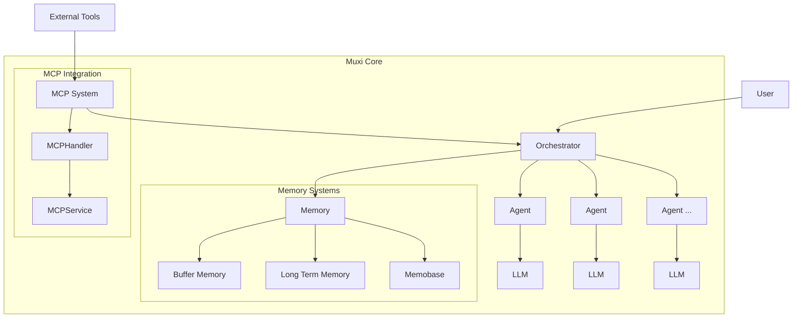

# Muxi Core Overview

The Muxi Core package is the foundation of the Muxi Framework, providing a comprehensive set of tools and utilities for building AI-powered applications with a focus on agent-based architectures. Designed with flexibility, scalability, and extensibility in mind, Muxi Core enables developers to create sophisticated AI systems that can interact with users, tools, and other agents.

## Architecture

Muxi Core follows a modular architecture organized around several key components:



### Core Components

1. **Orchestrator**: The central coordinator managing agents, memory systems, and external integrations.
2. **Agents**: Autonomous entities powered by language models that can process user requests and perform tasks.
3. **Memory Systems**: Mechanisms for storing and retrieving information across conversations and sessions.
4. **Model Context Protocol (MCP)**: Integration with external tools and systems via a standardized protocol.
5. **Models**: Abstractions for interacting with different language model providers.

## Design Principles

Muxi Core is built on several key design principles:

### 1. Centralized Orchestration

The Orchestrator serves as the central hub for managing agent interactions, memory access, and external integrations. This design allows for:

- Consistent memory management across agents
- Intelligent message routing
- Centralized authentication and authorization
- Coordinated multi-agent workflows

### 2. Memory-Centric Architecture

Memory systems are a first-class citizen in Muxi Core, with sophisticated memory management built into the framework:

- **Buffer Memory**: Short-term context retention using semantic search with FAISS
- **Long-Term Memory**: Persistent storage with vector database support
- **Memobase**: Multi-user memory system for user-specific information

### 3. Flexible Model Integration

The framework provides abstractions for working with multiple language model providers:

- Provider-agnostic model interfaces
- Consistent embedding generation
- Unified error handling and retries
- Streaming response support

### 4. Tool Integration via MCP

The Model Context Protocol (MCP) provides a standardized way to connect agents with external tools and systems:

- HTTP+SSE transport for real-time communication
- Command-line integration for local tools
- Standardized message format
- Robust error handling and timeouts

### 5. Multi-User Support

Built-in support for multi-user applications:

- User-specific memory contexts
- Authentication and authorization
- Session management
- User information extraction

## Component Interactions

### Agent-Orchestrator Interaction

Agents depend on the Orchestrator for memory access and coordination:

```python
# Agent requesting memory from Orchestrator
memories = await self.orchestrator.search_memory(
    query="user preferences",
    agent_id=self.agent_id,
    k=5
)
```

### Memory Management

The Orchestrator centralizes memory management:

```python
# Adding to buffer memory
await orchestrator.add_to_buffer_memory(
    message="User likes dark mode",
    metadata={"category": "preferences"}
)

# Searching long-term memory
results = await orchestrator.search_memory(
    query="user configuration",
    use_long_term=True
)
```

### MCP Tool Integration

Agents can access external tools through the MCP system:

```python
# Agent invoking an external tool
result = await self.invoke_tool(
    server_id="github",
    tool_name="list_repositories",
    parameters={"owner": "username"}
)
```

## Technical Specifications

- **Language**: Python 3.9+
- **Core Dependencies**:
  - FastAPI for API endpoints
  - SQLAlchemy with pgvector for vector storage
  - FAISS for efficient vector similarity search
  - Pydantic for data validation
  - MCP SDK for tool integration
  - Various LLM provider SDKs

## Coming Soon Features

- **Agent-to-Agent (A2A) Communication**: Direct communication between agents with specialized capabilities
- **Multi-Model Support**: Enhanced integration with multiple models per agent for specialized tasks
- **Advanced Reasoning Modules**: Structured reasoning frameworks for complex decision-making
- **Memory Optimization**: Advanced memory pruning and summarization techniques
