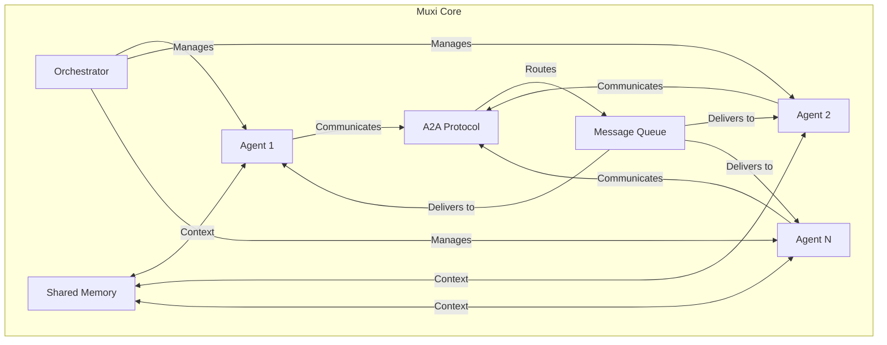
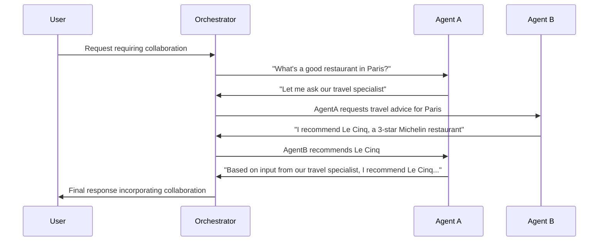
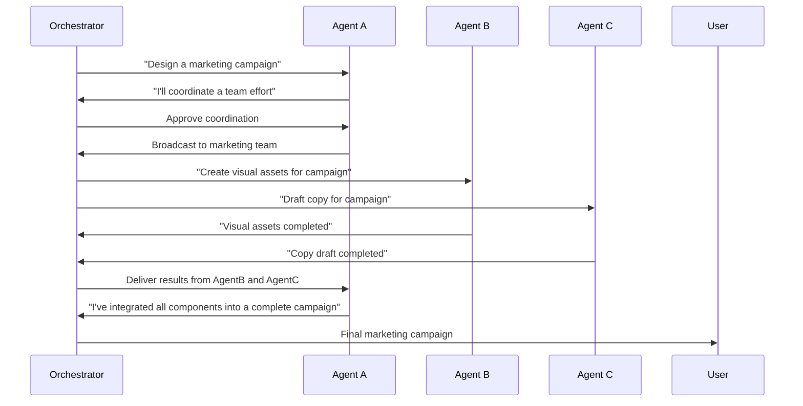
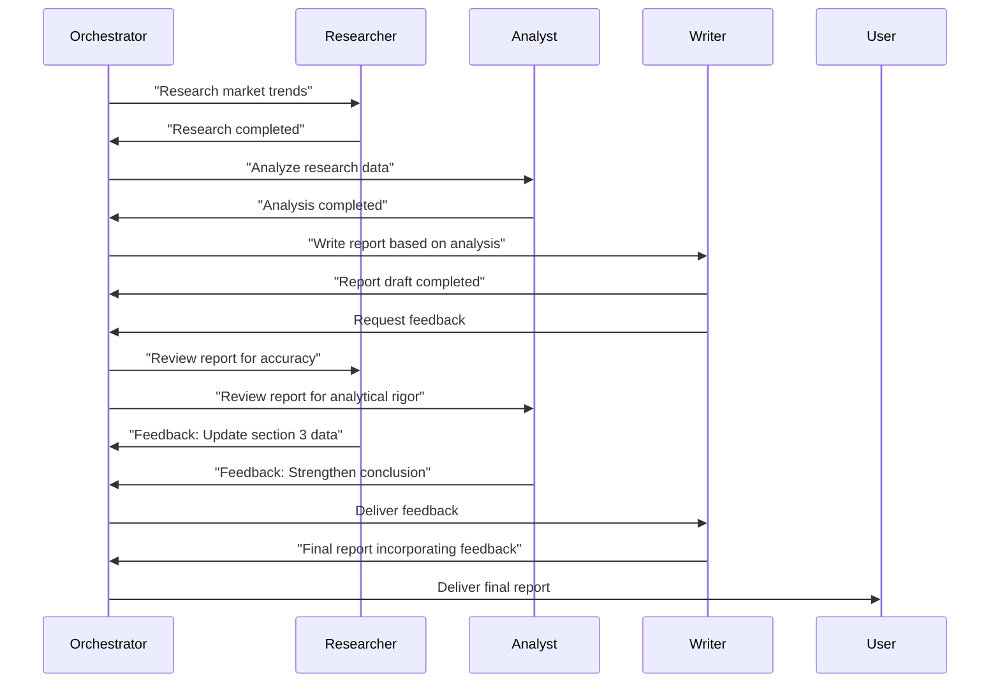

# Agent-to-Agent Communication in Muxi Core

Agent-to-Agent (A2A) communication is a powerful feature in Muxi Core that enables multiple agents to collaborate, share information, and solve complex problems together. This document details the A2A architecture, communication protocols, and implementation patterns.

## Agent-to-Agent Architecture



## Communication Modes

Muxi Core supports multiple agent-to-agent communication paradigms:

### 1. Direct Communication



### 2. Broadcast Communication



### 3. Collaborative Problem Solving



## Agent-to-Agent Implementation

### Core API

```python
from muxi.core.orchestrator import Orchestrator
from muxi.core.models.providers.openai import OpenAIModel

# Create orchestrator
orchestrator = Orchestrator()

# Create specialized agents
researcher = orchestrator.create_agent(
    agent_id="researcher",
    model=OpenAIModel(model="gpt-4o"),
    system_message="You are a research specialist who finds relevant information."
)

analyst = orchestrator.create_agent(
    agent_id="analyst",
    model=OpenAIModel(model="claude-3-opus-20240229"),
    system_message="You are a data analyst who examines information and provides insights."
)

writer = orchestrator.create_agent(
    agent_id="writer",
    model=OpenAIModel(model="gpt-4o"),
    system_message="You are a writer who creates polished content from research and analysis."
)

# Direct agent-to-agent communication
async def create_report(topic):
    # Step 1: Research
    research_result = await orchestrator.chat(
        message=f"Research the latest trends in {topic}. Be thorough and factual.",
        agent_id="researcher"
    )

    # Step 2: Analysis
    analysis_result = await orchestrator.chat(
        message=f"Analyze this research on {topic}: {research_result}",
        agent_id="analyst"
    )

    # Step 3: Writing
    final_report = await orchestrator.chat(
        message=f"Write a report on {topic} based on this research and analysis: \n\nResearch: {research_result}\n\nAnalysis: {analysis_result}",
        agent_id="writer"
    )

    return final_report
```

### Message Passing

```python
# Create a message from one agent to another
async def send_agent_message(from_agent_id, to_agent_id, message):
    formatted_message = f"[Message from {from_agent_id}]: {message}"

    # Store the message in memory for context
    await orchestrator.add_to_buffer_memory(
        message=formatted_message,
        metadata={
            "from_agent": from_agent_id,
            "to_agent": to_agent_id,
            "type": "agent_message"
        }
    )

    # Send the message to the receiving agent
    response = await orchestrator.chat(
        message=formatted_message,
        agent_id=to_agent_id,
        metadata={
            "from_agent": from_agent_id,
            "message_type": "agent_message"
        }
    )

    return response
```

### Advanced Agent Collaboration

```python
# Example: Collaborative content creation pipeline
async def collaborative_content_creation(topic):
    # Planning phase
    plan = await orchestrator.chat(
        message=f"Create a detailed plan for producing content about {topic}. "
              f"Include steps for research, analysis, and writing.",
        agent_id="planner"
    )

    # Research phase
    research = await send_agent_message(
        from_agent_id="planner",
        to_agent_id="researcher",
        message=f"Please research {topic} according to this plan: {plan}"
    )

    # Analysis phase
    analysis = await send_agent_message(
        from_agent_id="researcher",
        to_agent_id="analyst",
        message=f"Please analyze my research on {topic}: {research}"
    )

    # Writing phase
    draft = await send_agent_message(
        from_agent_id="analyst",
        to_agent_id="writer",
        message=f"Based on this research and analysis about {topic}, "
              f"please write a comprehensive article: \n\n"
              f"Research: {research}\n\n"
              f"Analysis: {analysis}"
    )

    # Editing phase
    edited = await send_agent_message(
        from_agent_id="writer",
        to_agent_id="editor",
        message=f"Please edit this draft article about {topic}: {draft}"
    )

    return edited
```

## Structured A2A Workflows

### Task Delegation Pattern

```python
# Task delegation with specialized agents
async def task_delegation(main_task):
    # Main agent assesses the task and determines subtasks
    assessment = await orchestrator.chat(
        message=f"Assess this task and determine which specialized agents should handle different parts: {main_task}",
        agent_id="coordinator"
    )

    # Parse the assessment to identify subtasks and agents
    # In a real implementation, this could use structured outputs or JSON
    subtasks = parse_subtasks(assessment)

    results = {}
    for subtask in subtasks:
        agent_id = subtask["agent_id"]
        task_description = subtask["description"]

        # Delegate the subtask to the appropriate agent
        result = await orchestrator.chat(
            message=task_description,
            agent_id=agent_id
        )

        results[agent_id] = result

    # Coordinator assembles the final result
    combined_results = "\n\n".join([f"{agent_id}: {result}" for agent_id, result in results.items()])

    final_result = await orchestrator.chat(
        message=f"Combine these results into a cohesive response to the original task: {main_task}\n\nResults from specialized agents:\n{combined_results}",
        agent_id="coordinator"
    )

    return final_result
```

### Review and Feedback Loop

```python
# Review and feedback loop between agents
async def review_and_feedback(content, max_iterations=3):
    current_content = content

    for i in range(max_iterations):
        # Writer produces or refines content
        if i == 0:
            current_content = await orchestrator.chat(
                message=f"Write initial content for: {content}",
                agent_id="writer"
            )

        # Reviewer provides feedback
        feedback = await orchestrator.chat(
            message=f"Review this content and provide specific improvement suggestions:\n\n{current_content}",
            agent_id="reviewer"
        )

        # Check if the content meets standards
        evaluation = await orchestrator.chat(
            message=f"Evaluate if this content needs further improvement based on this feedback:\n\nContent: {current_content}\n\nFeedback: {feedback}",
            agent_id="evaluator"
        )

        # If the evaluator determines it's good enough, stop iterations
        if "content meets standards" in evaluation.lower():
            break

        # Writer improves based on feedback
        current_content = await orchestrator.chat(
            message=f"Improve this content based on the reviewer's feedback:\n\nCurrent content: {current_content}\n\nFeedback: {feedback}",
            agent_id="writer"
        )

    return current_content
```

### Debate and Consensus

```python
# Debate and consensus pattern for complex decisions
async def debate_and_consensus(topic, perspective_agents):
    # Each agent presents their perspective
    perspectives = {}
    for agent_id in perspective_agents:
        perspective = await orchestrator.chat(
            message=f"Provide your perspective on {topic} based on your expertise.",
            agent_id=agent_id
        )
        perspectives[agent_id] = perspective

    # Format all perspectives for debate
    all_perspectives = "\n\n".join([f"{agent_id}: {perspective}" for agent_id, perspective in perspectives.items()])

    # Agents debate the topic
    debate_rounds = 3
    debate_history = all_perspectives

    for round in range(debate_rounds):
        round_responses = {}
        for agent_id in perspective_agents:
            response = await orchestrator.chat(
                message=f"Round {round+1} of debate on {topic}. Respond to other perspectives and refine your position:\n\n{debate_history}",
                agent_id=agent_id
            )
            round_responses[agent_id] = response

        round_summary = "\n\n".join([f"Round {round+1} - {agent_id}: {response}" for agent_id, response in round_responses.items()])
        debate_history += f"\n\n--- ROUND {round+1} ---\n{round_summary}"

    # Mediator synthesizes consensus
    consensus = await orchestrator.chat(
        message=f"Based on this debate about {topic}, synthesize a balanced consensus that incorporates the strongest points from each perspective:\n\n{debate_history}",
        agent_id="mediator"
    )

    return consensus
```

## A2A Memory and Context Sharing

### Shared Memory Context

```python
# Share memory between agents
async def share_context_between_agents():
    # Agent A adds information to memory
    await orchestrator.add_to_buffer_memory(
        message="The customer requested a blue theme and modern design elements.",
        metadata={
            "type": "customer_preference",
            "shared": True,  # Flag as shared information
            "from_agent": "customer_service"
        }
    )

    # Agent B retrieves shared context
    design_context = await orchestrator.search_memory(
        query="customer design preferences",
        filter_metadata={"type": "customer_preference", "shared": True}
    )

    # Agent B uses the shared context
    design_proposal = await orchestrator.chat(
        message=f"Create a design proposal based on these customer preferences: {design_context}",
        agent_id="designer"
    )

    return design_proposal
```

### Agent-Specific Context

```python
# Maintain agent-specific context
async def agent_specific_knowledge():
    # Add agent-specific knowledge
    await orchestrator.add_to_buffer_memory(
        message="When creating SQL queries, always use parameterized statements to prevent injection attacks.",
        metadata={
            "type": "best_practice",
            "agent_id": "database_expert",
            "shared": False
        }
    )

    # Later, the database expert can retrieve its specific knowledge
    best_practices = await orchestrator.search_memory(
        query="SQL best practices",
        filter_metadata={
            "type": "best_practice",
            "agent_id": "database_expert"
        }
    )

    # Using agent-specific knowledge
    sql_solution = await orchestrator.chat(
        message=f"Write a secure SQL query to retrieve user data, following these best practices: {best_practices}",
        agent_id="database_expert"
    )

    return sql_solution
```

## A2A Communication Protocols

### Task-Oriented Protocol

```python
# Task definition schema
task_schema = {
    "task_id": "unique_id_123",
    "requester_agent": "manager",
    "performer_agent": "specialist",
    "task_type": "research",
    "description": "Research quantum computing advances in 2024",
    "parameters": {
        "depth": "comprehensive",
        "focus_areas": ["algorithms", "hardware"]
    },
    "deadline": "2024-07-15T18:00:00Z",
    "priority": "high"
}

# Task response schema
response_schema = {
    "task_id": "unique_id_123",
    "status": "completed",  # or "in_progress", "failed", "rejected"
    "requester_agent": "manager",
    "performer_agent": "specialist",
    "result": "Comprehensive research on quantum computing...",
    "attachments": [],
    "completion_time": "2024-07-14T16:32:11Z",
    "notes": "Focused on the requested areas with additional insights"
}

# Task-oriented communication
async def task_based_communication(task):
    # Encode task as JSON
    task_json = json.dumps(task)

    # Send task to performer agent
    await send_agent_message(
        from_agent_id=task["requester_agent"],
        to_agent_id=task["performer_agent"],
        message=f"TASK_REQUEST: {task_json}"
    )

    # In a real implementation, you would have a way to wait for and retrieve the response
    # This is simplified for demonstration purposes
    response = await get_agent_response(task["task_id"])

    return response
```

### Query-Response Protocol

```python
# Query-response pattern
async def query_response(query_agent, responder_agent, query):
    # Format the query
    formatted_query = {
        "query_id": generate_id(),
        "query_type": "information_request",
        "query": query,
        "context": "Used for report on AI trends",
        "response_format": "detailed_text"
    }

    # Send query
    response = await send_agent_message(
        from_agent_id=query_agent,
        to_agent_id=responder_agent,
        message=f"QUERY: {json.dumps(formatted_query)}"
    )

    return response
```

## A2A Security and Governance

### Permission-Based Communication

```python
# Define agent permissions
agent_permissions = {
    "analyst": {
        "can_communicate_with": ["researcher", "writer"],
        "restricted_from": ["customer_service"],
        "protocols": ["query", "task"]
    },
    "researcher": {
        "can_communicate_with": ["analyst", "writer"],
        "restricted_from": [],
        "protocols": ["query", "task", "broadcast"]
    }
}

# Permission-checked communication
async def secure_agent_communication(from_agent_id, to_agent_id, message, protocol="query"):
    # Check if communication is allowed
    if to_agent_id in agent_permissions.get(from_agent_id, {}).get("restricted_from", []):
        raise PermissionError(f"Agent {from_agent_id} is not allowed to communicate with {to_agent_id}")

    if to_agent_id not in agent_permissions.get(from_agent_id, {}).get("can_communicate_with", []):
        raise PermissionError(f"Agent {from_agent_id} does not have permission to communicate with {to_agent_id}")

    if protocol not in agent_permissions.get(from_agent_id, {}).get("protocols", []):
        raise PermissionError(f"Agent {from_agent_id} does not have permission to use {protocol} protocol")

    # If all checks pass, send the message
    return await send_agent_message(from_agent_id, to_agent_id, message)
```

### Conversation Logging

```python
# Log all agent-to-agent communications
async def logged_agent_communication(from_agent_id, to_agent_id, message):
    # Create log entry
    log_entry = {
        "timestamp": datetime.utcnow().isoformat(),
        "from_agent": from_agent_id,
        "to_agent": to_agent_id,
        "message": message,
        "trace_id": generate_trace_id()
    }

    # Store log entry
    await orchestrator.add_to_long_term_memory(
        message=json.dumps(log_entry),
        metadata={
            "type": "a2a_communication_log",
            "from_agent": from_agent_id,
            "to_agent": to_agent_id
        }
    )

    # Send the message
    response = await send_agent_message(from_agent_id, to_agent_id, message)

    # Log the response
    response_log = {
        "timestamp": datetime.utcnow().isoformat(),
        "from_agent": to_agent_id,
        "to_agent": from_agent_id,
        "message": response,
        "trace_id": log_entry["trace_id"],
        "is_response": True
    }

    await orchestrator.add_to_long_term_memory(
        message=json.dumps(response_log),
        metadata={
            "type": "a2a_communication_log",
            "from_agent": to_agent_id,
            "to_agent": from_agent_id,
            "is_response": True
        }
    )

    return response
```

## Advanced A2A Communication Patterns

### Hierarchical Communication

```python
# Hierarchical team of agents
async def hierarchical_team(task):
    # Manager assigns and coordinates subtasks
    plan = await orchestrator.chat(
        message=f"Create a plan to accomplish this task with our team: {task}",
        agent_id="manager"
    )

    # Parse the plan into subtasks (in a real implementation, use structured output)
    subtasks = parse_plan_into_subtasks(plan)

    # Assign subtasks to team members
    subtask_results = {}
    for subtask in subtasks:
        worker_id = subtask["agent_id"]
        subtask_description = subtask["description"]

        # Manager delegates to worker
        result = await send_agent_message(
            from_agent_id="manager",
            to_agent_id=worker_id,
            message=f"Please complete this subtask: {subtask_description}"
        )

        subtask_results[worker_id] = result

    # Manager compiles and reviews results
    compiled_results = "\n\n".join([f"{agent_id}: {result}" for agent_id, result in subtask_results.items()])

    final_result = await orchestrator.chat(
        message=f"Review and finalize the results of our team's work on '{task}':\n\n{compiled_results}",
        agent_id="manager"
    )

    return final_result
```

### Peer-to-Peer Collaboration

```python
# P2P collaboration pattern
async def peer_collaboration(topic, agent_ids):
    # Initialize shared context
    shared_context = f"Topic: {topic}\n\nInitial ideas:"

    # Iterative collaboration rounds
    for round in range(3):
        round_contributions = {}

        # Each agent contributes based on the evolving shared context
        for agent_id in agent_ids:
            contribution = await orchestrator.chat(
                message=f"Round {round+1}: Contribute to our collaborative work on '{topic}' based on the current state:\n\n{shared_context}",
                agent_id=agent_id
            )

            round_contributions[agent_id] = contribution

        # Update shared context with this round's contributions
        round_summary = "\n\n".join([f"{agent_id}: {contribution}" for agent_id, contribution in round_contributions.items()])
        shared_context += f"\n\n--- ROUND {round+1} CONTRIBUTIONS ---\n{round_summary}"

    # Final synthesis by all agents
    final_contributions = {}
    for agent_id in agent_ids:
        synthesis = await orchestrator.chat(
            message=f"Based on our collaborative work, provide your final synthesis on '{topic}':\n\n{shared_context}",
            agent_id=agent_id
        )

        final_contributions[agent_id] = synthesis

    # Combine final contributions
    final_result = "\n\n".join([f"FINAL SYNTHESIS BY {agent_id}:\n{synthesis}" for agent_id, synthesis in final_contributions.items()])

    return final_result
```

## Emergent A2A Behaviors

### Self-Organizing Agent Teams

```python
# Self-organizing agent teams
async def self_organizing_team(problem, available_agents):
    # Team formation phase
    team_formation = await orchestrator.chat(
        message=f"Analyze this problem and determine the optimal team composition from these available agents: {available_agents}",
        agent_id="orchestrator_agent"
    )

    # Parse team formation (in a real implementation, use structured output)
    selected_agents = parse_team_formation(team_formation)

    # Team planning phase
    team_plan = await orchestrator.chat(
        message=f"Create a collaborative plan for our team to solve this problem: {problem}",
        agent_id="orchestrator_agent"
    )

    # Execute the plan with dynamic role assignment
    # In a real implementation, this would use more structure and agent messaging
    result = await execute_team_plan(team_plan, selected_agents, problem)

    return result
```

### Adaptive Agent Roles

```python
# Adaptive agent roles based on context
async def adaptive_roles(task):
    # Analyze the task to determine needed roles
    role_analysis = await orchestrator.chat(
        message=f"Analyze this task and determine what specialized roles are needed: {task}",
        agent_id="coordinator"
    )

    # Parse the role analysis
    required_roles = parse_roles(role_analysis)

    # Configure agents with the appropriate roles
    for role in required_roles:
        role_name = role["name"]
        role_description = role["description"]
        system_message = role["system_message"]

        # Either create a new agent or reconfigure existing one
        orchestrator.create_agent(
            agent_id=f"{role_name}_agent",
            system_message=system_message,
            model=OpenAIModel(model="gpt-4o")
        )

    # Execute the task with dynamically assigned roles
    # Implementation would vary based on the task structure
    result = await execute_with_roles(task, required_roles)

    return result
```

## Coming Soon Features

The A2A framework in Muxi Core is actively evolving, with several exciting features on the roadmap:

- **Agent Networks**: Formalized network topologies for agent-to-agent communication, including hub-and-spoke, mesh, and hierarchical designs
- **Multi-Model A2A Teams**: Teams of agents powered by different models (Claude, GPT-4, Gemini, etc.) leveraging the unique strengths of each
- **Agent Specialization Libraries**: Pre-configured agent specialists for common domains (research, writing, coding, etc.)
- **A2A Communication Standards**: Standardized protocols for more sophisticated agent interactions
- **Visual A2A Workflow Builder**: Graphical interface for designing and deploying agent collaboration patterns
- **Real-time A2A Communication**: Support for streaming responses between agents for more dynamic collaboration
- **A2A Memory Optimization**: Specialized memory systems for efficient agent collaboration
- **Cross-Orchestrator A2A**: Enable agents from different Muxi Core instances to collaborate
- **A2A Analytics**: Metrics and insights for measuring and optimizing agent collaboration
- **Adversarial Testing**: Red team/blue team agent configurations for security and quality testing
