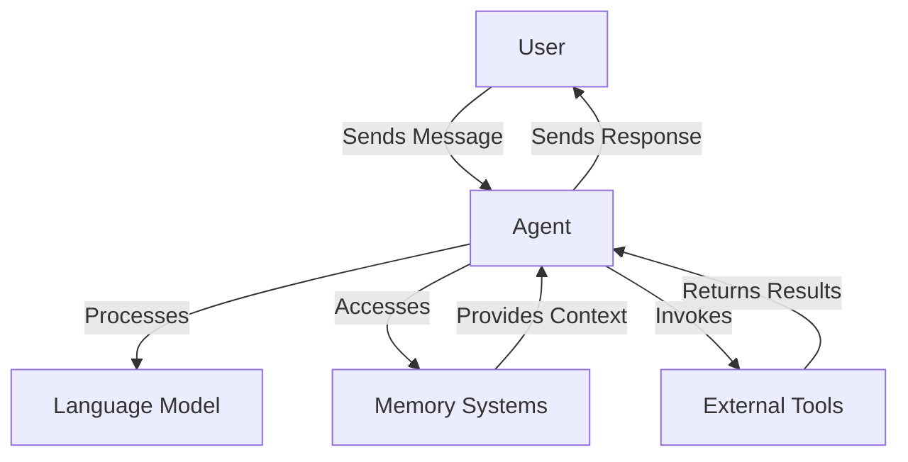

# Agents in Muxi Core

Agents are the primary interface through which Muxi Core interacts with users. An agent is powered by a language model and can be specialized for particular domains or tasks.

## Agent Architecture

A Muxi agent consists of the following core components:



### Key Components

1. **Language Model**: The foundation of every agent, providing natural language understanding and generation
2. **Memory Access**: Connection to shared or agent-specific memory systems
3. **Tool Access**: Ability to use external tools via MCP
4. **Conversation Management**: Tracking context and message history

## Creating Agents

Agents in Muxi Core are typically created through the Orchestrator, which manages their lifecycle and provides them with access to centralized resources.

### Basic Agent Creation

```python
from muxi.core.orchestrator import Orchestrator
from muxi.core.models.providers.openai import OpenAIModel

# Create a model
model = OpenAIModel(model="gpt-4o")

# Create an orchestrator
orchestrator = Orchestrator()

# Create an agent
agent = orchestrator.create_agent(
    agent_id="assistant",
    model=model,
    system_message="You are a helpful assistant.",
    set_as_default=True
)
```

### Configuration Options

When creating an agent, you can configure:

- **agent_id**: Unique identifier for the agent
- **model**: The language model powering the agent
- **system_message**: Instructions defining the agent's behavior and persona
- **name**: Human-readable name for the agent (defaults to Agent-{id})
- **description**: Description used for routing (defaults to system_message)
- **set_as_default**: Whether this agent should be the default for unrouted messages
- **mcp_server**: Optional MCP server for tool usage

### Manually Creating Agents

While the recommended approach is to create agents through the Orchestrator, you can also create them directly:

```python
from muxi.core.agent import Agent
from muxi.core.models.providers.openai import OpenAIModel

# Create a model
model = OpenAIModel(model="gpt-4o")

# Create an agent
agent = Agent(
    model=model,
    orchestrator=orchestrator,  # Still requires an orchestrator reference
    system_message="You are a helpful assistant.",
    agent_id="assistant"
)

# Register with orchestrator manually
orchestrator.add_agent(agent, set_as_default=True)
```

## Agent Types and Specialization

Muxi Core supports creating specialized agents for different purposes:

### General Assistant

```python
general_agent = orchestrator.create_agent(
    agent_id="general",
    model=model,
    system_message="You are a helpful general assistant.",
    description="General-purpose assistant for everyday questions and conversation",
    set_as_default=True
)
```

### Domain Expert

```python
code_agent = orchestrator.create_agent(
    agent_id="code",
    model=model,
    system_message=(
        "You are a coding expert specializing in software development. "
        "Provide detailed, accurate code examples and explanations."
    ),
    description="Expert in programming, algorithms, and software engineering"
)
```

### Tool-Specialized Agent

```python
from muxi.core.agent import MCPServer

# Configure MCP server
github_server = MCPServer(
    name="github",
    url="https://mcp-server.example.com/github"
)

# Create agent with tool specialization
github_agent = orchestrator.create_agent(
    agent_id="github",
    model=model,
    system_message=(
        "You are a GitHub assistant that can help users with repository management. "
        "Use your GitHub tools to find repositories, create issues, and more."
    ),
    description="Specialized assistant for GitHub repository management",
    mcp_server=github_server
)
```

## Agent Operations

### Processing Messages

The primary function of an agent is to process messages:

```python
# Direct message processing
response = await agent.process_message("What is the capital of France?")

# Through orchestrator (recommended)
response = await orchestrator.run_agent(
    input_text="What is the capital of France?",
    agent_id="assistant"
)
```

### Using Memory

Agents automatically use the orchestrator's memory systems:

```python
# Access relevant memories
memories = await agent.get_relevant_memories(
    query="What did we discuss about project timelines?",
    limit=5
)

# Memory is automatically updated during conversations
await agent.process_message("The project deadline is October 15th.")
```

### Using Tools

Agents can use tools via MCP:

```python
# Invoke a specific tool
result = await agent.invoke_tool(
    server_id="weather",
    tool_name="get_weather",
    parameters={"location": "New York", "units": "celsius"}
)

# Tools are automatically called during message processing
response = await agent.process_message(
    "What's the weather like in New York today?"
)
```

## Agent-to-Agent Interaction (Coming Soon)

Future versions of Muxi Core will support direct agent-to-agent communication:

```python
# Example of planned agent-to-agent interaction
response = await orchestrator.agent_to_agent(
    message="Generate a graph for these data points: [1, 3, 5, 7, 9]",
    from_agent_id="assistant",
    to_agent_id="data_visualizer"
)
```

## Multi-Agent Systems

Muxi Core excels at managing multiple specialized agents:

### Setting Up a Multi-Agent System

```python
# Create specialized agents
general_agent = orchestrator.create_agent(
    agent_id="general",
    model=model,
    system_message="You are a helpful general assistant.",
    description="General-purpose assistant for everyday questions and conversation",
    set_as_default=True
)

code_agent = orchestrator.create_agent(
    agent_id="code",
    model=model,
    system_message="You are a coding expert specializing in software development.",
    description="Expert in programming, algorithms, and software engineering"
)

math_agent = orchestrator.create_agent(
    agent_id="math",
    model=model,
    system_message="You are a mathematics expert.",
    description="Expert in mathematics, statistics, and numerical problem-solving"
)
```

### Intelligent Message Routing

The orchestrator can automatically route messages to the appropriate agent:

```python
# Automatic agent selection
selected_agent_id = await orchestrator.select_agent_for_message(
    "What's the best way to implement quicksort in Python?"
)
# Returns "code" based on message content

# Process with the selected agent
response = await orchestrator.run_agent(
    input_text="What's the best way to implement quicksort in Python?",
    agent_id=selected_agent_id
)
```

### Manual Agent Selection

Users can also manually select which agent to use:

```python
# Chat with a specific agent
response = await orchestrator.chat(
    message="Solve the equation x^2 - 4 = 0",
    agent_name="math"  # Directly specify which agent to use
)
```

## Agent Lifecycle Management

The orchestrator manages the complete lifecycle of agents:

```python
# List all agents
agents = orchestrator.list_agents()
print(agents)

# Set a default agent
orchestrator.set_default_agent("general")

# Remove an agent
orchestrator.remove_agent("deprecated_agent")
```

## Advanced Agent Configuration

### Custom Model Providers

Agents can use any model that implements the BaseModel interface:

```python
# Example with Anthropic model
from muxi.core.models.providers.anthropic import AnthropicModel

anthropic_model = AnthropicModel(
    model="claude-3-opus-20240229",
    temperature=0.5
)

agent = orchestrator.create_agent(
    agent_id="assistant",
    model=anthropic_model,
    system_message="You are a helpful assistant powered by Claude."
)
```

### Request Timeouts

Configure timeouts for tool usage:

```python
# Set a specific timeout for this agent's tool requests
agent = orchestrator.create_agent(
    agent_id="assistant",
    model=model,
    system_message="You are a helpful assistant.",
    mcp_server=mcp_server,
    request_timeout=120  # 2 minutes
)
```

## Best Practices

### System Message Design

The system message is crucial for agent behavior:

- **Be specific**: Clearly define the agent's role and capabilities
- **Set boundaries**: Define what the agent should and shouldn't do
- **Include examples**: Demonstrate the expected input/output format
- **Define persona**: Establish the agent's tone and personality

### Example System Messages

General Assistant:
```
You are a helpful, friendly assistant. You provide accurate, concise answers
to user questions. If you don't know something, you admit it rather than
making up information. You're polite and respectful in all interactions.
```

Code Assistant:
```
You are a software development expert. You provide clean, efficient, and
well-documented code examples. You explain your code clearly and point out
potential issues or optimizations. You specialize in Python, JavaScript,
and Go, but can assist with other languages as well. When providing code
solutions, always consider best practices, security, and performance.
```

Data Scientist:
```
You are a data science assistant specializing in statistics, machine learning,
and data analysis. You help users understand complex data concepts and implement
analytical solutions. When discussing statistical methods, you explain the
underlying assumptions and limitations. You provide code examples in Python
using libraries like pandas, numpy, scikit-learn, and tensorflow. Always
consider data quality and ethical implications in your recommendations.
```

### Agent Descriptions for Routing

Write clear, distinctive descriptions to improve routing accuracy:

```python
orchestrator.create_agent(
    agent_id="weather",
    model=model,
    system_message="You are a weather information specialist.",
    description=(
        "Specialized in providing current weather conditions, forecasts, "
        "and historical weather data for locations worldwide. Can answer "
        "questions about temperature, precipitation, wind conditions, "
        "severe weather alerts, and climate patterns."
    )
)
```

### Memory Context Optimization

Help agents make better use of memory:

- Use metadata to categorize memory items
- Include user_id in metadata for multi-user systems
- Set appropriate recency_bias for different agent types
  - Research agents: Lower recency_bias (0.1-0.2)
  - Conversational agents: Higher recency_bias (0.4-0.6)

## Upcoming Features

- **Agent-to-Agent Communication**: Direct communication between specialized agents
- **Agent Teams**: Organize agents into teams for complex workflows
- **Multi-Model Agents**: Use different models for different tasks within the same agent
- **Agent Evaluation**: Built-in framework for evaluating agent performance
- **Agent Configuration Templates**: Predefined configurations for common agent types
