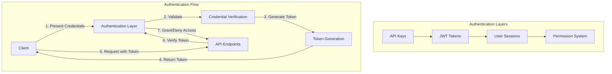

# Authentication in Muxi Core

Muxi Core provides robust authentication mechanisms to secure your AI applications. This document details the authentication features available in Muxi Core.

## Authentication Architecture

Muxi Core implements a layered authentication architecture:



## API Keys

API keys are the primary authentication mechanism for Muxi Core:

```python
from muxi.core.orchestrator import Orchestrator

# Create an orchestrator with API keys
orchestrator = Orchestrator()

# Access API keys
user_api_key = orchestrator.user_api_key
admin_api_key = orchestrator.admin_api_key

print(f"User API Key: {user_api_key}")
print(f"Admin API Key: {admin_api_key}")
```

### Creating API Keys

```python
# Create a new user API key
new_user_key = orchestrator.create_api_key(is_admin=False)

# Create a new admin API key
new_admin_key = orchestrator.create_api_key(is_admin=True)
```

### Validating API Keys

```python
# Validate a user API key
is_valid_user = orchestrator.validate_api_key(
    key="user_api_key_123",
    require_admin=False
)

# Validate an admin API key
is_valid_admin = orchestrator.validate_api_key(
    key="admin_api_key_456",
    require_admin=True
)
```

### API Key Storage

By default, API keys are stored in memory, but you can configure persistent storage:

```python
from muxi.core.orchestrator import Orchestrator
from muxi.core.storage.api_keys import SqliteApiKeyStorage

# Create a persistent API key storage
api_key_storage = SqliteApiKeyStorage(db_path="/path/to/keys.db")

# Create an orchestrator with persistent API key storage
orchestrator = Orchestrator(api_key_storage=api_key_storage)
```

## JWT Authentication

JWT (JSON Web Tokens) provide a more flexible authentication mechanism:

```python
# Generate a JWT token
token = orchestrator.generate_jwt_token(
    user_id="user_123",
    expiration=3600  # 1 hour expiration
)

# Validate a JWT token
try:
    payload = orchestrator.validate_jwt_token(token="eyJhbGciOiJIUzI1...")
    user_id = payload.get("sub")  # subject claim contains user_id
    print(f"Valid token for user: {user_id}")
except Exception as e:
    print(f"Invalid token: {e}")
```

### JWT Configuration

Configure JWT settings:

```python
from muxi.core.orchestrator import Orchestrator
from muxi.core.config.app import AppConfig

# Configure JWT settings
config = AppConfig(
    jwt_algorithm="HS256",
    secret_key="your-secret-key",  # Use a secure secret key in production
    jwt_expiration=3600  # Default token expiration in seconds
)

# Create orchestrator with JWT configuration
orchestrator = Orchestrator(config=config)
```

### JWT Claims

Customize JWT claims:

```python
# Generate a token with custom claims
token = orchestrator.generate_jwt_token(
    user_id="user_123",
    expiration=3600,
    additional_claims={
        "name": "John Doe",
        "email": "john@example.com",
        "role": "premium",
        "permissions": ["read", "write"]
    }
)
```

## Session Management

Muxi Core provides session management for tracking user interactions:

```python
# Create a user session
session_id = orchestrator.create_user_session(
    user_id="user_123",
    metadata={
        "source": "web",
        "device": "desktop",
        "ip": "192.168.1.1",
        "user_agent": "Mozilla/5.0..."
    }
)

# Use session ID in a conversation
response = await orchestrator.chat(
    message="Hello",
    agent_name="assistant",
    user_id="user_123",
    session_id=session_id
)

# Get session information
session = orchestrator.get_user_session(session_id=session_id)
print(session)

# End a session
orchestrator.end_user_session(session_id=session_id)
```

### Session Storage

Configure session storage:

```python
from muxi.core.orchestrator import Orchestrator
from muxi.core.storage.sessions import RedisSessionStorage

# Create a Redis session storage
session_storage = RedisSessionStorage(
    redis_url="redis://localhost:6379/0",
    prefix="muxi_session:",
    expiration=86400  # 24 hours
)

# Create orchestrator with custom session storage
orchestrator = Orchestrator(session_storage=session_storage)
```

## Authentication with FastAPI

Integrate Muxi Core authentication with FastAPI:

```python
from fastapi import FastAPI, Depends, HTTPException, Security
from fastapi.security import APIKeyHeader, HTTPBearer
from pydantic import BaseModel

app = FastAPI()
orchestrator = Orchestrator()

# API Key Authentication
api_key_header = APIKeyHeader(name="X-API-Key")

async def get_user_from_api_key(api_key: str = Security(api_key_header)):
    if orchestrator.validate_api_key(key=api_key):
        # In a real app, lookup user_id based on API key
        return "user_123"
    raise HTTPException(
        status_code=401,
        detail="Invalid API key",
        headers={"WWW-Authenticate": "API-Key"},
    )

# JWT Authentication
security = HTTPBearer()

async def get_user_from_jwt(credentials = Depends(security)):
    try:
        payload = orchestrator.validate_jwt_token(credentials.credentials)
        user_id = payload.get("sub")
        if not user_id:
            raise HTTPException(status_code=401, detail="Invalid token")
        return user_id
    except Exception:
        raise HTTPException(status_code=401, detail="Invalid token")

# Chat endpoint with API Key auth
@app.post("/chat/api-key")
async def chat_with_api_key(
    message: str,
    user_id: str = Depends(get_user_from_api_key)
):
    response = await orchestrator.chat(
        message=message,
        user_id=user_id
    )
    return {"response": response}

# Chat endpoint with JWT auth
@app.post("/chat/jwt")
async def chat_with_jwt(
    message: str,
    user_id: str = Depends(get_user_from_jwt)
):
    response = await orchestrator.chat(
        message=message,
        user_id=user_id
    )
    return {"response": response}
```

## User Authentication Flow

Complete user authentication flow:

```python
from fastapi import FastAPI, Depends, HTTPException
from fastapi.security import OAuth2PasswordBearer, OAuth2PasswordRequestForm
from pydantic import BaseModel

app = FastAPI()
orchestrator = Orchestrator()

# Mock user database (replace with your actual user storage)
USERS = {
    "johndoe": {
        "username": "johndoe",
        "email": "john@example.com",
        "hashed_password": "fakehashedsecret",
        "user_id": "user_123"
    }
}

def verify_password(plain_password, hashed_password):
    # Replace with proper password verification
    return plain_password + "fakehashed" == hashed_password

def get_user(username: str):
    if username in USERS:
        return USERS[username]
    return None

class Token(BaseModel):
    access_token: str
    token_type: str

oauth2_scheme = OAuth2PasswordBearer(tokenUrl="token")

@app.post("/token", response_model=Token)
async def login_for_access_token(form_data: OAuth2PasswordRequestForm = Depends()):
    user = get_user(form_data.username)
    if not user or not verify_password(form_data.password, user["hashed_password"]):
        raise HTTPException(
            status_code=401,
            detail="Incorrect username or password",
            headers={"WWW-Authenticate": "Bearer"},
        )

    access_token = orchestrator.generate_jwt_token(
        user_id=user["user_id"],
        additional_claims={"username": user["username"]}
    )

    return {"access_token": access_token, "token_type": "bearer"}

async def get_current_user(token: str = Depends(oauth2_scheme)):
    try:
        payload = orchestrator.validate_jwt_token(token)
        user_id = payload.get("sub")
        username = payload.get("username")
        if not user_id or not username:
            raise HTTPException(status_code=401, detail="Invalid token")

        # Find user by username
        user = get_user(username)
        if not user:
            raise HTTPException(status_code=401, detail="User not found")

        return user
    except Exception:
        raise HTTPException(status_code=401, detail="Invalid token")

@app.get("/users/me")
async def read_users_me(current_user: dict = Depends(get_current_user)):
    return current_user

@app.post("/chat")
async def chat(
    message: str,
    current_user: dict = Depends(get_current_user)
):
    response = await orchestrator.chat(
        message=message,
        user_id=current_user["user_id"]
    )
    return {"response": response}
```

## Role-Based Access Control

Implement role-based access control:

```python
from fastapi import FastAPI, Depends, HTTPException, Security
from fastapi.security import HTTPBearer

app = FastAPI()
security = HTTPBearer()

# Role-based permission checking
def has_permission(required_role: str):
    async def check_permission(credentials = Depends(security)):
        try:
            payload = orchestrator.validate_jwt_token(credentials.credentials)
            user_role = payload.get("role", "user")

            # Role hierarchy: admin > premium > user
            role_hierarchy = {
                "admin": 3,
                "premium": 2,
                "user": 1
            }

            if role_hierarchy.get(user_role, 0) >= role_hierarchy.get(required_role, 0):
                return payload.get("sub")  # Return user_id

            raise HTTPException(
                status_code=403,
                detail=f"Requires {required_role} role"
            )
        except Exception as e:
            raise HTTPException(status_code=401, detail=str(e))
    return check_permission

# User-level endpoint (all authenticated users)
@app.get("/features/basic")
async def basic_features(user_id: str = Depends(has_permission("user"))):
    return {"features": ["chat", "search"]}

# Premium-level endpoint
@app.get("/features/premium")
async def premium_features(user_id: str = Depends(has_permission("premium"))):
    return {"features": ["chat", "search", "advanced_tools", "priority_support"]}

# Admin-level endpoint
@app.get("/admin/dashboard")
async def admin_dashboard(user_id: str = Depends(has_permission("admin"))):
    return {"admin": "dashboard"}
```

## Multi-User Authentication

Managing authentication for multiple users:

```python
# Generate tokens for multiple users
user1_token = orchestrator.generate_jwt_token(user_id="user_1")
user2_token = orchestrator.generate_jwt_token(user_id="user_2")

# Create user-specific sessions
user1_session = orchestrator.create_user_session(user_id="user_1")
user2_session = orchestrator.create_user_session(user_id="user_2")

# Chat with user-specific context
async def chat_with_user_context(message, token, session_id=None):
    try:
        # Validate token
        payload = orchestrator.validate_jwt_token(token)
        user_id = payload.get("sub")

        # Chat with user context
        response = await orchestrator.chat(
            message=message,
            user_id=user_id,
            session_id=session_id
        )

        return {"user_id": user_id, "response": response}
    except Exception as e:
        return {"error": str(e)}
```

## Authentication Events and Hooks

Track authentication events:

```python
# Register authentication event handlers
@orchestrator.register_hook("on_token_generated")
async def token_generated_hook(user_id, token_type, expiration):
    print(f"Token generated for user {user_id}")
    # Log to database, analytics, etc.

@orchestrator.register_hook("on_token_validated")
async def token_validated_hook(user_id, token_type):
    print(f"Token validated for user {user_id}")
    # Update last_active timestamp, etc.

@orchestrator.register_hook("on_token_invalid")
async def token_invalid_hook(token, error):
    print(f"Invalid token: {error}")
    # Log security events, detect attack patterns, etc.

@orchestrator.register_hook("on_session_created")
async def session_created_hook(user_id, session_id, metadata):
    print(f"Session {session_id} created for user {user_id}")
    # Track user activity
```

## Security Best Practices

Muxi Core authentication follows security best practices:

### Secure Configuration

```python
import os
import secrets
from muxi.core.config.app import AppConfig

# Generate a secure secret key
secret_key = os.getenv("SECRET_KEY") or secrets.token_hex(32)

# Configure with secure settings
config = AppConfig(
    secret_key=secret_key,
    jwt_algorithm="HS256",
    jwt_expiration=3600,  # Short-lived tokens (1 hour)
    cors_origins=["https://your-app.com"],  # Restrict CORS
    debug=False,  # Disable debug in production
    enable_docs=False  # Disable Swagger in production
)

orchestrator = Orchestrator(config=config)
```

### Rate Limiting

```python
from muxi.core.security.rate_limit import RateLimiter

# Create a rate limiter
rate_limiter = RateLimiter(
    redis_url="redis://localhost:6379/0",
    max_requests=100,  # Max requests per time window
    time_window=60,    # Time window in seconds
)

# Use in FastAPI
@app.post("/token")
async def login_for_access_token(
    form_data: OAuth2PasswordRequestForm = Depends()
):
    # Check rate limit
    client_ip = request.client.host
    if not rate_limiter.check_rate_limit(f"login:{client_ip}"):
        raise HTTPException(status_code=429, detail="Too many login attempts")

    # Proceed with authentication
    # ...
```

### Token Revocation

```python
# Create token blacklist
token_blacklist = set()

# Revoke a token
def revoke_token(token):
    token_blacklist.add(token)

# Custom token validator with blacklist check
def validate_token_with_blacklist(token):
    if token in token_blacklist:
        raise ValueError("Token has been revoked")

    # Proceed with regular validation
    return orchestrator.validate_jwt_token(token)
```

## API Authentication Endpoints

Complete authentication API:

```python
from fastapi import FastAPI, Depends, HTTPException, Request
from fastapi.security import OAuth2PasswordRequestForm, HTTPBearer
from pydantic import BaseModel
from typing import Optional
import time

app = FastAPI()
orchestrator = Orchestrator()
security = HTTPBearer()

class Token(BaseModel):
    access_token: str
    token_type: str
    expires_in: int

class RefreshToken(BaseModel):
    refresh_token: str

class TokenResponse(BaseModel):
    access_token: str
    refresh_token: str
    token_type: str
    expires_in: int

class UserCreate(BaseModel):
    username: str
    password: str
    email: str

@app.post("/auth/register", response_model=Token)
async def register(user: UserCreate):
    # Check if user exists
    # Hash password
    # Create user in database
    # ...

    # Generate tokens
    access_token = orchestrator.generate_jwt_token(
        user_id="new_user_id",
        expiration=3600
    )

    return {
        "access_token": access_token,
        "token_type": "bearer",
        "expires_in": 3600
    }

@app.post("/auth/token", response_model=TokenResponse)
async def login(form_data: OAuth2PasswordRequestForm = Depends()):
    # Authenticate user
    # ...

    # Generate tokens
    access_token = orchestrator.generate_jwt_token(
        user_id="user_123",
        expiration=3600
    )

    refresh_token = orchestrator.generate_jwt_token(
        user_id="user_123",
        expiration=86400 * 30,  # 30 days
        additional_claims={"token_type": "refresh"}
    )

    return {
        "access_token": access_token,
        "refresh_token": refresh_token,
        "token_type": "bearer",
        "expires_in": 3600
    }

@app.post("/auth/refresh", response_model=Token)
async def refresh_token(refresh: RefreshToken):
    try:
        # Validate refresh token
        payload = orchestrator.validate_jwt_token(refresh.refresh_token)

        # Check token type
        if payload.get("token_type") != "refresh":
            raise HTTPException(status_code=400, detail="Not a refresh token")

        # Generate new access token
        access_token = orchestrator.generate_jwt_token(
            user_id=payload.get("sub"),
            expiration=3600
        )

        return {
            "access_token": access_token,
            "token_type": "bearer",
            "expires_in": 3600
        }
    except Exception as e:
        raise HTTPException(status_code=401, detail=str(e))

@app.post("/auth/logout")
async def logout(credentials = Depends(security)):
    token = credentials.credentials
    # Add token to blacklist or invalidate session
    # ...
    return {"message": "Successfully logged out"}
```

## Coming Soon Features

Upcoming authentication features in Muxi Core:

- **OAuth2 Integration**: Support for OAuth2 providers (Google, GitHub, etc.)
- **MFA Support**: Multi-factor authentication options
- **Enhanced Session Management**: Advanced session tracking and control
- **Login Anomaly Detection**: AI-powered detection of suspicious login patterns
- **Granular Permissions System**: Fine-grained access control for resources
