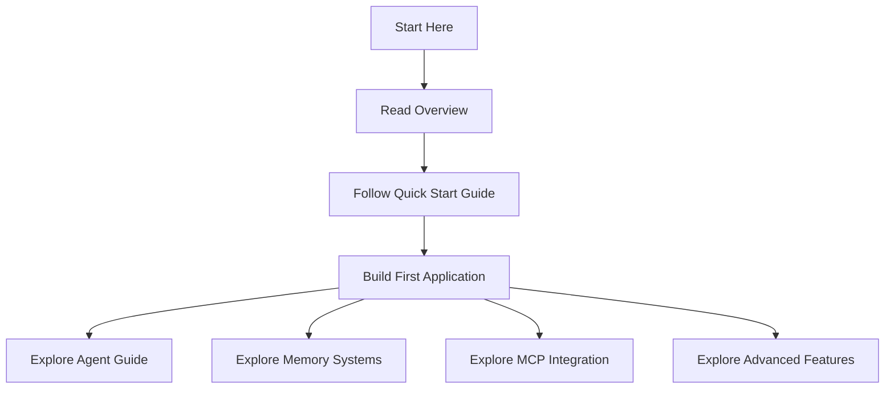
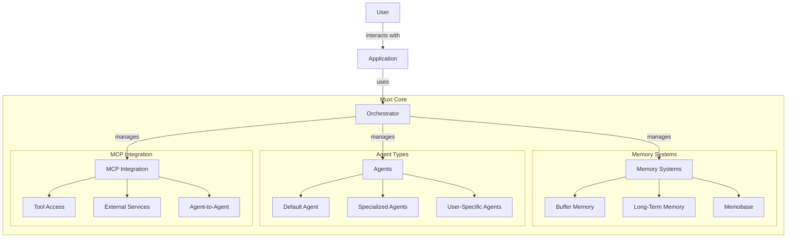

# Muxi Core Documentation

This documentation covers the core components, features, and usage patterns of the Muxi Framework.

## Table of Contents

- [Overview](overview.md): Introduction to Muxi Core architecture and design principles
- [Features](features.md): Key features and capabilities of Muxi Core
- [Quickstart](quickstart.md): Getting started with Muxi Core
- [Agents](agents.md): Creating and managing agents
- [Conversations](conversations.md): Managing conversations and message flows
- [Memory Systems](memory-systems.md): Buffer, long-term, and memobase memory
- [Orchestrator](orchestrator.md): Central coordination component
- [Configuration](config.md): Configuration system and options
- [Multi-User Support](multi-user-support.md): Managing multiple users
- [MCP Integration](mcp-integration.md): Integrating with MCP for tools
- [Authentication](authentication.md): Security and user authentication
- [Agent-to-Agent Communication](agent-to-agent.md): Agent collaboration patterns

## Getting Started

If you're new to Muxi, we recommend starting with the [Overview](overview.md) to understand the core architecture, followed by the [Quickstart](quickstart.md) guide to set up your first Muxi application.

## Key Concepts

The Muxi Framework is built around several key concepts:

1. **Agents**: Autonomous entities powered by language models that can process requests and perform tasks
2. **Orchestrator**: The central coordinator managing agents, memory systems, and external integrations
3. **Memory Systems**: Mechanisms for storing and retrieving information across conversations
4. **Configuration**: Flexible system for customizing framework behavior
5. **MCP Integration**: Connection with external tools via the Model Context Protocol

## Advanced Topics

Once you're familiar with the basics, explore advanced topics:

- [Agent-to-Agent Communication](agent-to-agent.md) for complex workflows
- [Multi-User Support](multi-user-support.md) for building multi-tenant applications
- [Memory Systems](memory-systems.md) for sophisticated context management
- [Configuration](config.md) for customizing framework behavior

## Examples

Find complete examples in the `examples` directory of the repository:

- Simple chat applications
- Multi-agent systems
- Tool integration examples
- Custom agent implementations

## API Reference

For detailed API documentation, see the inline code documentation or generate API docs using:

```bash
cd packages/core
pydoc-markdown
```

## Contributing

Contributions to Muxi Core are welcome! See the [Contributing Guide](../../CONTRIBUTING.md) for more information.



## Example Usage

Here's a simple example of creating an agent with Muxi Core:

```python
from muxi.core.orchestrator import Orchestrator
from muxi.core.models.providers.openai import OpenAIModel
import os

# Set your API key
os.environ["OPENAI_API_KEY"] = "your-api-key"

# Create a model
model = OpenAIModel(
    model="gpt-4o",
    temperature=0.7
)

# Create an orchestrator
orchestrator = Orchestrator()

# Create an agent
agent = orchestrator.create_agent(
    agent_id="assistant",
    model=model,
    system_message="You are a helpful assistant.",
    set_as_default=True
)

# Chat with the agent
async def chat_example():
    response = await orchestrator.chat(
        message="Hello, can you help me with Python programming?",
        agent_id="assistant"
    )
    print(response)

# Run the chat example
import asyncio
asyncio.run(chat_example())
```

## Architecture Overview

Muxi Core is built with a modular, extensible architecture:



## API Overview

Muxi Core provides a clean, intuitive API:

- **Orchestrator**: The central component that manages agents, memory, and other systems
- **Agent**: Intelligent entities that can process messages and use tools
- **Memory**: Systems for storing and retrieving information
- **MCP**: Model Control Protocol integration for tool usage

Key functions include:

- `orchestrator.create_agent()` - Create a new agent
- `orchestrator.chat()` - Send a message to an agent
- `orchestrator.search_memory()` - Search for relevant information
- `orchestrator.add_to_buffer_memory()` - Add information to buffer memory
- `orchestrator.add_to_long_term_memory()` - Add information to long-term memory

## Coming Soon

The Muxi Core framework is actively being developed, with many exciting features on the roadmap:

- **Agent-to-Agent Communication**: Enhanced agent collaboration features
- **Multi-Model Support**: Use multiple model providers in the same application
- **Advanced Memory Management**: Better memory compression and organization
- **Visual Tools**: Graphical interfaces for building and managing agents
- **Federated Learning**: Distributed learning across multiple instances
- **Streaming Responses**: Real-time streaming of agent responses
- **Custom Model Support**: Easier integration of custom models

## Support

For questions, issues, or feedback, please:

- Check the existing documentation
- Search for known issues
- Contact the development team

We're continuously improving Muxi Core and welcome your feedback and contributions!
