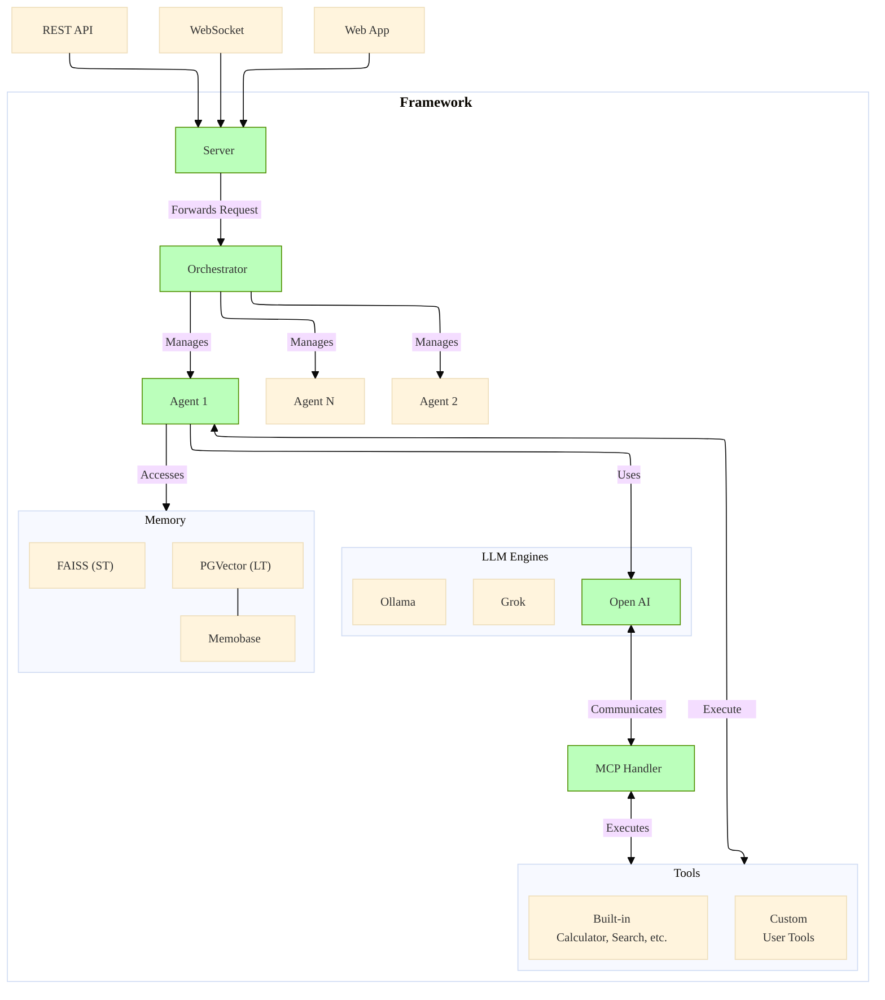

# Architecture

```mermaid
---
config:
  theme: base
  themeVariables:
    fontFamily: ''
    fontSize: 13px
  flowchart:
    defaultRenderer: elk
  layout: fixed
---
flowchart TB
    subgraph MS["Memory"]
        Buffer["FAISS (ST)"]
        PGSQL["PGVector (LT)"]
        MBASE["Memobase"]
    end
    subgraph LE["LLM Engines"]
        LLM["Open AI"]
        Grok["Grok"]
        Ollama["Ollama"]
    end
    subgraph Tools["Tools"]
        BuiltIn["Built-in<br>Calculator, Search, etc."]
        Custom["Custom<br>User Tools"]
    end
    subgraph AIA["<b><big>Framework</big></b>"]
        Server["Server"]
        Orchestrator["Orchestrator"]
        Agent["Agent 1"]
        Agent2["Agent 2"]
        AgentN["Agent N"]
        MCP["MCP Handler"]
        MS
        LE
        Tools
    end
    REST["&nbsp;REST API&nbsp;"] --> Server
    WS["&nbsp;WebSocket&nbsp;"] --> Server
    APP["&nbsp;Web App&nbsp;"] --> Server
    Server -- &nbsp;Forwards Request&nbsp; --> Orchestrator
    Orchestrator -- &nbsp;Manages&nbsp; --> Agent & Agent2 & AgentN
    Agent -- Uses --> LLM
    Agent <-- &nbsp; &nbsp; &nbsp;Execute&nbsp; &nbsp; &nbsp; --> Tools
    Agent -- &nbsp;Accesses&nbsp; --> MS
    LLM <-- &nbsp;Communicates&nbsp; --> MCP
    MCP <-- &nbsp;Executes&nbsp; --> Tools
    PGSQL --- MBASE

    style LLM fill:#bfb,stroke:#4f8f00
    style Server fill:#bfb,stroke:#4f8f00
    style Orchestrator fill:#bfb,stroke:#4f8f00
    style Agent fill:#bfb,stroke:#4f8f00
    style MCP fill:#bfb,stroke:#4f8f00
    style AIA fill:#fff
```
