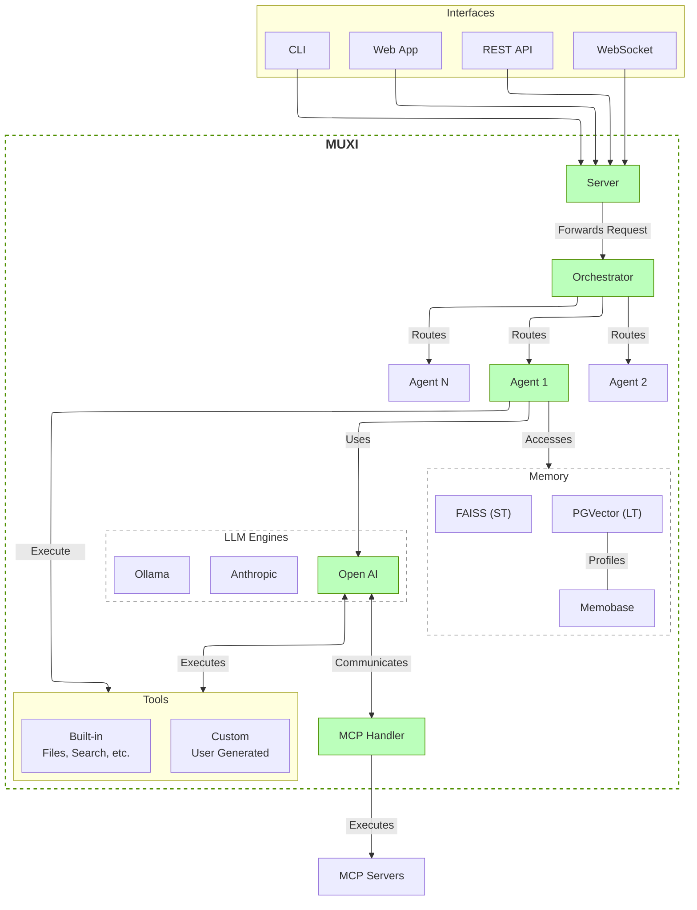

# Architecture

The MUXI framework consists of several core components that work together to provide a flexible and powerful agent-based system.

## Architecture Diagram

## Component Descriptions

### User Interfaces
- **REST API**: HTTP endpoints for agent management and communication
- **WebSocket**: Real-time bidirectional communication for streaming responses
- **Web App**: Browser-based interface for interacting with agents
- **CLI**: Command-line interface for local agent interaction

### Core Framework
- **Server**: Handles incoming requests from different interfaces
- **Orchestrator**: Manages multiple agents and their interactions
- **Agents**: Autonomous entities that process requests using models, memory, and tools
- **MCP Handler**: Model Context Protocol for standardized communication with LLM providers

### Memory Systems
- **FAISS (ST)**: Short-term buffer memory using vector embeddings
- **PGVector (LT)**: Long-term persistent memory using PostgreSQL with vector extensions
- **Memobase**: User-aware memory partitioning for multi-tenant applications

### LLM Engines
- **OpenAI**: Integration with OpenAI models (GPT-4, etc.)
- **Anthropic**: Integration with Anthropic models (Claude, etc.)
- **Ollama**: Support for local models via Ollama

### Tools
- **Built-in Tools**: File operations, web search, calculator, etc.
- **Custom Tools**: User-created tools to extend agent capabilities

## Data Flow

1. User requests come in through one of the interfaces (REST, WebSocket, Web App, CLI)
2. Server forwards requests to the Orchestrator
3. Orchestrator directs requests to the appropriate Agent
4. Agent processes requests using:
   - LLM for generating responses
   - Memory for context and persistence
   - Tools for performing actions
5. MCP Handler standardizes communication between the framework and LLM providers
6. Responses are sent back through the original interface
