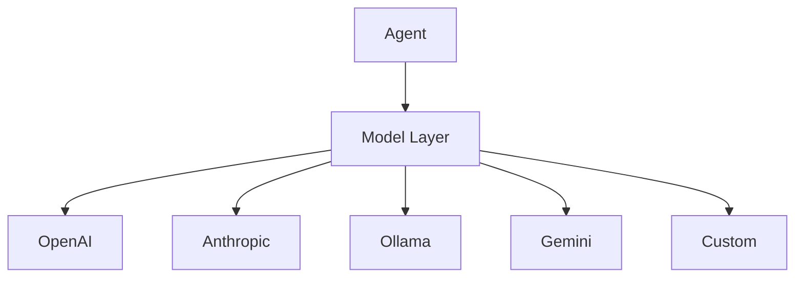

# LLM Models

The MUXI framework integrates with various Large Language Model (LLM) providers through a standardized Model Context Protocol (MCP) interface. This document explains how models are integrated, configured, and used within the framework.

## Supported LLM Providers

MUXI currently supports the following LLM providers:

- **OpenAI** - Access to GPT-3.5, GPT-4, and other OpenAI models
- **Anthropic** - Support for Claude models (planned)
- **Ollama** - Integration with locally hosted models (planned)
- **Gemini** - Google's Gemini models (planned)
- **Custom Models** - Integration with custom-hosted models

## The Model Layer

The model layer in MUXI serves as an abstraction between your agents and the underlying LLM providers:



### Key Components

1. **Model Classes**: Provider-specific implementations that handle communication with each LLM API
2. **MCP Adapter**: Converts between MUXI's internal format and the provider-specific formats
3. **Configuration**: Settings for controlling model behavior, temperature, etc.
4. **Response Processing**: Handles streaming, parsing, and error management

## Using Models in MUXI

### Basic Model Configuration

```python
from src.models.openai import OpenAIModel

# Create a model with default settings
model = OpenAIModel(model="gpt-4o")

# Create a model with custom settings
custom_model = OpenAIModel(
    model="gpt-4-turbo",
    temperature=0.7,
    max_tokens=2000,
    top_p=1.0,
    frequency_penalty=0.0,
    presence_penalty=0.0
)
```

### Assigning Models to Agents

```python
from src.core.orchestrator import Orchestrator
from src.models.openai import OpenAIModel
from src.memory.buffer import BufferMemory

# Create an orchestrator
orchestrator = Orchestrator()

# Create an agent with a specific model
orchestrator.create_agent(
    agent_id="assistant",
    model=OpenAIModel(model="gpt-4o"),
    buffer_memory=BufferMemory(),
    system_message="You are a helpful AI assistant."
)
```

### Switching Models

You can update an agent's model at any time:

```python
# Switch to a different model
new_model = OpenAIModel(model="gpt-3.5-turbo")
orchestrator.update_agent(
    agent_id="assistant",
    model=new_model
)
```

## Model Configuration Options

### OpenAI Models

| Parameter | Description | Default | Valid Range |
|-----------|-------------|---------|------------|
| model | The model to use | "gpt-4o" | Any valid OpenAI model ID |
| temperature | Controls randomness | 0.7 | 0.0 - 2.0 |
| max_tokens | Max tokens to generate | 1000 | 1 - 8192 (model dependent) |
| top_p | Nucleus sampling parameter | 1.0 | 0.0 - 1.0 |
| frequency_penalty | Penalizes repeated tokens | 0.0 | -2.0 - 2.0 |
| presence_penalty | Penalizes repeated topics | 0.0 | -2.0 - 2.0 |

### Anthropic Models (Planned)

| Parameter | Description | Default | Valid Range |
|-----------|-------------|---------|------------|
| model | The model to use | "claude-3-opus" | Any valid Anthropic model |
| temperature | Controls randomness | 0.7 | 0.0 - 1.0 |
| max_tokens | Max tokens to generate | 1000 | 1 - model dependent |
| top_p | Nucleus sampling parameter | 1.0 | 0.0 - 1.0 |

## Streaming Responses

MUXI supports streaming responses from LLMs, which is particularly useful for real-time applications:

```python
# Enable streaming for WebSocket or CLI
response_stream = orchestrator.stream_chat(
    agent_id="assistant",
    message="Generate a detailed explanation of quantum computing",
    user_id=123  # Optional, for multi-user agents
)

# Process the stream
for chunk in response_stream:
    # Each chunk is a piece of the response as it's generated
    print(chunk, end="", flush=True)
```

## Handling Model Errors

MUXI provides built-in error handling for common LLM provider issues:

- **API Errors**: Connection issues, rate limits, etc.
- **Context Length Exceeded**: Automatic handling of token limit issues
- **Content Policy Violations**: Detection and management of blocked content
- **Timeouts**: Graceful handling of slow responses

## Model Selection Best Practices

### Choosing the Right Model

- **GPT-4/Claude-3**: For complex reasoning, creative tasks, or when accuracy is critical
- **GPT-3.5**: For simpler tasks, faster responses, or cost-sensitive applications
- **Local Models**: For privacy-sensitive applications or offline usage

### Performance Optimization

- **Prompt Engineering**: Craft effective prompts to get better results
- **Temperature Settings**: Lower for factual tasks, higher for creative ones
- **Token Management**: Balance context size vs cost by trimming unnecessary content
- **Request Batching**: Group similar requests to reduce API overhead

## Multi-Model Strategies

For advanced use cases, MUXI supports using different models for different agents or tasks:

```python
# Create specialized agents with different models
orchestrator.create_agent(
    agent_id="researcher",
    model=OpenAIModel(model="gpt-4o"), # Powerful model for complex research
    system_message="You are a research assistant skilled in deep analysis."
)

orchestrator.create_agent(
    agent_id="responder",
    model=OpenAIModel(model="gpt-3.5-turbo"), # Faster model for simple responses
    system_message="You communicate research findings in simple language."
)
```

## Model Context Protocol (MCP)

The MCP standardizes communication between MUXI and LLM providers, enabling seamless switching between different models. For more details, see the [MCP documentation](mcp).

## Extending with New Model Providers

MUXI is designed to be extensible. To add support for a new LLM provider:

1. Create a new model class that implements the model interface
2. Implement the provider-specific API communication
3. Create an MCP adapter for the provider
4. Register the new model type with the framework

Example of a custom model provider implementation:

```python
from src.models.base import BaseModel
from src.models.mcp import MCPMessage, MCPRole

class CustomProviderModel(BaseModel):
    def __init__(self, api_key=None, model="default-model", **kwargs):
        super().__init__()
        self.api_key = api_key or os.environ.get("CUSTOM_PROVIDER_API_KEY")
        self.model = model
        self.base_url = "https://api.customprovider.com/v1"
        self.kwargs = kwargs

    async def generate(self, messages, **kwargs):
        # Convert MCP messages to provider format
        provider_messages = self._convert_to_provider_format(messages)

        # Call the provider API
        response = await self._call_api(provider_messages, **kwargs)

        # Convert response back to MCP format
        return self._convert_to_mcp_format(response)

    # Implement other required methods...
```

## Upcoming Model Enhancements

Future updates to MUXI's model layer will include:

- **Model Fallbacks**: Automatic fallback to alternative models if primary fails
- **Model Routing**: Intelligent routing of requests to appropriate models
- **Performance Monitoring**: Tracking of model performance and cost metrics
- **Fine-tuned Model Support**: Integration with custom fine-tuned models
- **Multi-modal Capabilities**: Support for image and audio inputs/outputs

## See Also

- [Model Context Protocol (MCP)](mcp)
- [Agents](agent)
- [Orchestrator](orchestrator)
- [Tools vs MCP](tools_vs_mcp)
